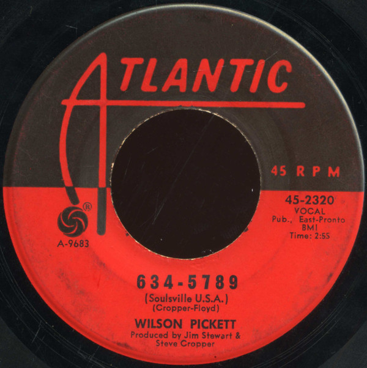

# 634-5789 (Soulsville, U.S.A.)

By Wilson Pickett

## Album Data

[Discogs URL](https://www.discogs.com/release/6104607-Wilson-Pickett-634-5789-Soulsville-USA)

- Label: Atlantic
- Formats: Vinyl, 7", 45 RPM, Single
- Genres: Funk / Soul, Soul
- Rating: 0
- Released: 1966
- Year: 1966
- Release ID: 6104607
- Media condition: 
- Sleeve condition: 
- Speed: 
- Weight: 
- Notes: 

## Album Tracks

| **Position** | **Title** | **Duration** |
|--------------|-----------|--------------|
| A | **634-5789 (Soulsville, U.S.A.)** | 2:55 |
| B | **That's A Man's Way** | 2:20 |

## Artist Roles

| **Name** | **Role** |
|----------|----------|
| **Jim Stewart** | Producer |
| **Steve Cropper** | Producer |

