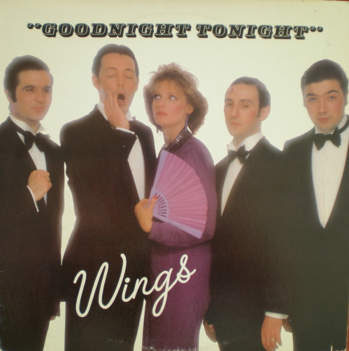

# Goodnight Tonight

By Wings

## Album Data

[Discogs URL](https://www.discogs.com/release/795978-Wings-Goodnight-Tonight)

- Label: Columbia
MPL (2)
- Formats: Vinyl, 12", Single, 33 ⅓ RPM
- Genres: Rock, Funk / Soul, Pop Rock, Disco
- Rating: 4.45
- Released: 1979
- Year: 1979
- Release ID: 795978
- Media condition: 
- Sleeve condition: 
- Speed: 
- Weight: 
- Notes: 

## Album Tracks

| **Position** | **Title** | **Duration** |
|--------------|-----------|--------------|
| A | **Goodnight Tonight** | 7:25 |
| B | **Daytime Nightime Suffering** | 3:19 |

## Artist Roles

| **Name** | **Role** |
|----------|----------|
| **Paul McCartney** | Written-By |

