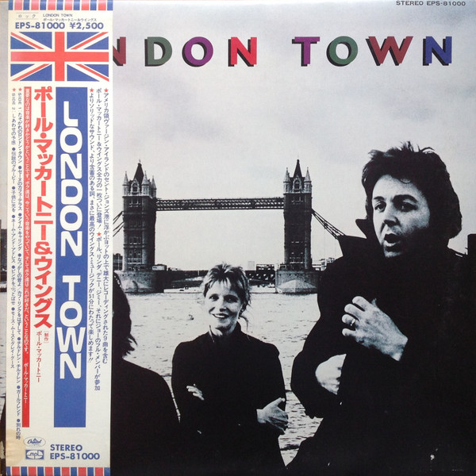

# London Town

By Wings

## Album Data

[Discogs URL](https://www.discogs.com/release/1837504-Wings-London-Town)

- Label: Capitol Records
MPL (2)
- Formats: Vinyl, LP, Album, Stereo
- Genres: Rock, Pop Rock, Classic Rock, Soft Rock
- Rating: 3.81
- Released: 1978
- Year: 1978
- Release ID: 1837504
- Media condition: 
- Sleeve condition: 
- Speed: 
- Weight: 
- Notes: 

## Album Tracks

| **Position** | **Title** | **Duration** |
|--------------|-----------|--------------|
| A1 | **London Town** | 4:10 |
| A2 | **Cafe On The Left Bank** | 3:25 |
| A3 | **I'm Carrying** | 2:44 |
| A4 | **Backwards Traveller** | 1:07 |
| A5 | **Cuff Link** | 2:03 |
| A6 | **Children Children** | 2:20 |
| A7 | **Girlfriend** | 4:31 |
| A8 | **I've Had Enough** | 3:02 |
| B1 | **With A Little Luck** | 5:45 |
| B2 | **Famous Groupies** | 3:34 |
| B3 | **Deliver Your Children** | 4:17 |
| B4 | **Name And Address** | 3:07 |
| B5 | **Don't Let It Bring You Down** | 4:34 |
| B6 | **Morse Moose And The Grey Goose** | 6:27 |

## Artist Roles

| **Name** | **Role** |
|----------|----------|
| **Aubrey Powell** | Cover [Coordination] |
| **George Hardie** | Cover [Coordination] |
| **Denny Laine** | Design, Photography By |
| **Linda McCartney** | Design, Photography By |
| **Paul McCartney** | Design, Photography By |
| **Geoff Emerick** | Engineer |
| **Mark Vigars** | Engineer [Assistant] |
| **Peter Henderson** | Engineer [Assistant] |
| **Steve Churchyard** | Engineer [Assistant] |
| **Jimmy McCulloch** | Guitar, Percussion |
| **John Golden** | Lacquer Cut By |
| **Graham Hughes (2)** | Photography By [Additional] |
| **Henry Diltz** | Photography By [Additional] |
| **Paul McCartney** | Producer |
| **Paul McCartney** | Producer, Vocals, Guitar, Bass, Keyboards, Drums, Percussion, Violin, Flageolet, Recorder |
| **Joe English** | Vocals, Drums, Percussion, Harmonica |
| **Denny Laine** | Vocals, Guitar, Bass, Flageolet, Recorder, Percussion |
| **Linda McCartney** | Vocals, Keyboards, Percussion |

