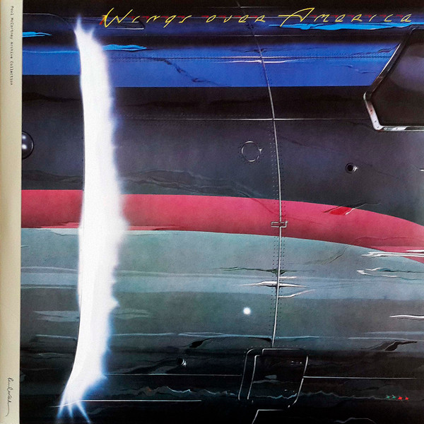

# Wings Over America

By Wings

## Album Data

[Discogs URL](https://www.discogs.com/release/4611368-Wings-Wings-Over-America)

- Label: MPL (2)
Hear Music
Concord Music Group
- Formats: Vinyl, LP, Album, Reissue, Remastered
- Genres: Rock, Pop, Pop Rock, Ballad
- Rating: 4.61
- Released: 2013
- Year: 1976
- Release ID: 4611368
- Media condition: 
- Sleeve condition: 
- Speed: 
- Weight: 
- Notes: 

## Album Tracks

| **Position** | **Title** | **Duration** |
|--------------|-----------|--------------|
| A1 | **Venus And Mars / Rock Show / Jet** |  |
| A2 | **Let Me Roll It** |  |
| A3 | **Spirit Of Ancient Egypt** |  |
| A4 | **Medicine Jar** |  |
| B1 | **Maybe I'm Amazed** |  |
| B2 | **Call Me Back Again** |  |
| B3 | **Lady Madonna** |  |
| B4 | **The Long And Winding Road** |  |
| B5 | **Live And Let Die** |  |
| C1 | **Picasso's Last Words** |  |
| C2 | **Richard Cory** |  |
| C3 | **Bluebird** |  |
| C4 | **I've Just Seen A Face** |  |
| C5 | **Blackbird** |  |
| C6 | **Yesterday** |  |
| D1 | **You Gave Me The Answer** |  |
| D2 | **Magneto And Titanium Man** |  |
| D3 | **Go Now** |  |
| D4 | **My Love** |  |
| D5 | **Listen To What The Man Said** |  |
| E1 | **Let 'Em In** |  |
| E2 | **Time To Hide** |  |
| E3 | **Silly Love Songs** |  |
| E4 | **Beware My Love** |  |
| F1 | **Letting Go** |  |
| F2 | **Band On The Run** |  |
| F3 | **Hi, Hi, Hi** |  |
| F4 | **Soily** |  |

## Artist Roles

| **Name** | **Role** |
|----------|----------|
| **Geoff Halpin** | Design [Lettering] |
| **Richard Evans (7)** | Design, Graphics |
| **Jeff Cummins** | Design, Painting [Inner] |
| **Richard Manning (3)** | Design, Painting [Outer] |
| **Robert Ellis (4)** | Design, Photography By [Poster] |
| **Hipgnosis (2)** | Design, Sleeve |
| **MPL Communications** | Design, Sleeve |
| **Joe English** | Drums, Vocals |
| **Jack Maxson** | Engineer [Recording] |
| **Mark Vigars** | Engineer [Recording] |
| **Phil McDonald** | Engineer [Recording] |
| **Tom Walsh (3)** | Engineer [Recording] |
| **Paul McCartney** | Producer |
| **Guy Massey** | Remastered By [Audio Remastered] |
| **Simon Gibson** | Remastered By [Audio Remastered] |
| **Steve Rooke** | Remastered By [Audio Remastered] |
| **Howie Casey** | Saxophone |
| **Thaddeus Richard** | Saxophone, Clarinet, Flute |
| **Tony Dorsey** | Trombone |
| **Steve Howard** | Trumpet, Flugelhorn |
| **Paul McCartney** | Vocals, Bass Guitar, Piano, Acoustic Guitar |
| **Jimmy McCulloch** | Vocals, Electric Guitar, Acoustic Guitar, Bass |
| **Denny Laine** | Vocals, Electric Guitar, Acoustic Guitar, Piano, Bass, Goblet Drum [Gob Iron] |
| **Linda McCartney** | Vocals, Keyboards |

