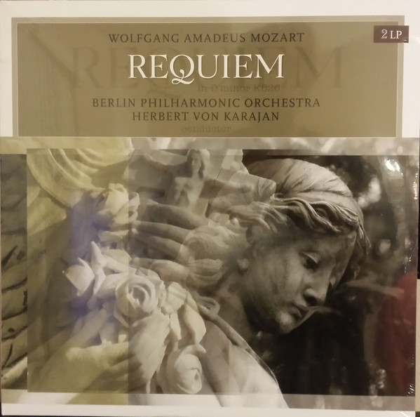

# Requiem In D Minor K626

By Wolfgang Amadeus Mozart

## Album Data

[Discogs URL](https://www.discogs.com/release/7896588-Wolfgang-Amadeus-Mozart-Herbert-von-Karajan-Requiem-In-D-Minor-K626)

- Label: Vinyl Passion Classical
- Formats: Vinyl, LP, Stereo
- Genres: Classical, Classical, Religious
- Rating: 4.88
- Released: 2015
- Year: 1961
- Release ID: 7896588
- Media condition: 
- Sleeve condition: 
- Speed: 
- Weight: 
- Notes: 

## Album Tracks

| **Position** | **Title** | **Duration** |
|--------------|-----------|--------------|
| A1 | **I. Introitus - Requiem** |  |
| A2 | **II. Kyrie, III. Sequenz** |  |
| A3 | **No.1 Dies irae** |  |
| A4 | **No.2 Tuba mirum** |  |
| B1 | **No.3 Rex tremendae** |  |
| B2 | **No.4 Recordare** |  |
| B3 | **No.5 Confutatis** |  |
| B4 | **No.6 Lacrimosa** |  |
| C1 | **IV. Offertoruim - No.1 Domine Jesu** |  |
| C2 | **No.2 Hostias** |  |
| D1 | **V. Sanctus** |  |
| D2 | **VI. Benedictus** |  |
| D3 | **VII. Angus Dei** |  |
| D4 | **VII. Communio** |  |

## Artist Roles

| **Name** | **Role** |
|----------|----------|
| **Hilde Rössel-Majdan** | Alto Vocals, Contralto Vocals |
| **Walter Berry** | Bass Vocals |
| **Wiener Singverein** | Chorus |
| **Reinhold Schmid** | Chorus Master |
| **Wolfgang Amadeus Mozart** | Composed By |
| **Wolfgang Meyer (3)** | Organ |
| **Wilma Lipp** | Soprano Vocals |
| **Anton Dermota** | Tenor Vocals |

