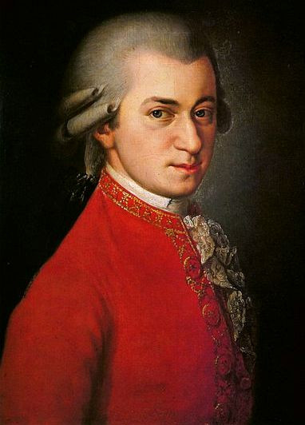

# Wolfgang Amadeus Mozart

## Artist Profile

Wolfgang Amadeus Mozart was born on January 27, 1756, the son of Leopold Mozart. He was a prolific and highly influential composer of classical music. His enormous output of more than six hundred compositions includes works that are widely acknowledged as pinnacles of symphonic, chamber, piano, operatic, and choral music. Mozart is among the most enduringly popular of European composers, and many of his works are part of the standard concert repertoire. He died on December 5, 1791.

Constanze Mozart is the wife of Wolfgang Amadeus Mozart.

## Artist Links

- [https://en.wikipedia.org/wiki/Wolfgang_Amadeus_Mozart](https://en.wikipedia.org/wiki/Wolfgang_Amadeus_Mozart)
- [https://mozarteum.at/](https://mozarteum.at/)
- [https://www.facebook.com/StiftungMozarteum/](https://www.facebook.com/StiftungMozarteum/)
- [https://www.instagram.com/stiftungmozarteum/](https://www.instagram.com/stiftungmozarteum/)
- [https://www.youtube.com/user/StiftungMozarteum](https://www.youtube.com/user/StiftungMozarteum)
- [https://wolfgang-amadeus-mozart.bandcamp.com/](https://wolfgang-amadeus-mozart.bandcamp.com/)
- [https://twitter.com/MozartAmadeus_](https://twitter.com/MozartAmadeus_)
- [https://soundcloud.com/mozart](https://soundcloud.com/mozart)
- [https://www.youtube.com/c/WolfgangAmadeusMozart-YouTubeChannel](https://www.youtube.com/c/WolfgangAmadeusMozart-YouTubeChannel)
- [https://www.famouscomposers.net/wolfgang-amadeus-mozart](https://www.famouscomposers.net/wolfgang-amadeus-mozart)
- [https://www.britannica.com/biography/Wolfgang-Amadeus-Mozart](https://www.britannica.com/biography/Wolfgang-Amadeus-Mozart)
- [https://www.treccani.it/enciclopedia/wolfgang-amadeus-mozart/](https://www.treccani.it/enciclopedia/wolfgang-amadeus-mozart/)
- [https://www.operadis-opera-discography.org.uk/CLORMOZA.HTM](https://www.operadis-opera-discography.org.uk/CLORMOZA.HTM)
- [https://www.imdb.com/name/nm0003665/](https://www.imdb.com/name/nm0003665/)

## See also

- [Requiem In D Minor K626](Requiem_In_D_Minor_K626.md)
