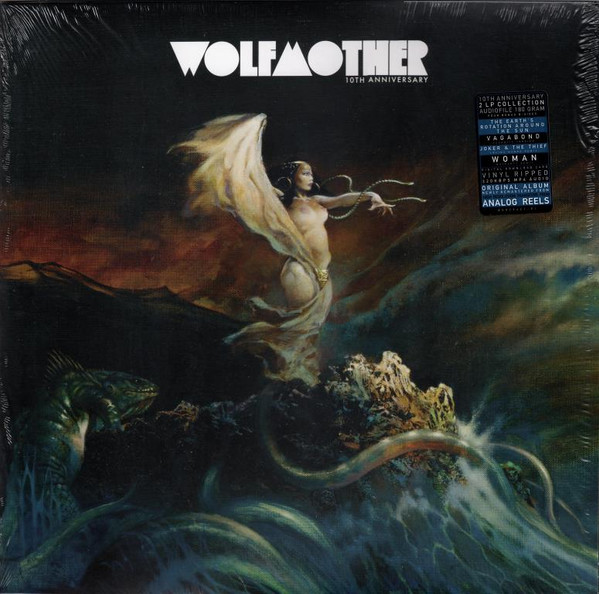

# Wolfmother

By Wolfmother

## Album Data

[Discogs URL](https://www.discogs.com/release/7554358-Wolfmother-Wolfmother)

- Label: Modular Recordings
Interscope Records
- Formats: Vinyl, LP, Album, Deluxe Edition, Reissue, Remastered
- Genres: Rock, Hard Rock, Psychedelic Rock
- Rating: 4.57
- Released: 2015-09-23
- Year: 2005
- Release ID: 7554358
- Media condition: 
- Sleeve condition: 
- Speed: 
- Weight: 
- Notes: 

## Album Tracks

| **Position** | **Title** | **Duration** |
|--------------|-----------|--------------|
| A1 | **Dimension** | 4:21 |
| A2 | **White Unicorn** | 5:04 |
| A3 | **Woman** | 2:56 |
| A4 | **Where Eagles Have Been** | 5:33 |
| B1 | **Apple Tree** | 3:30 |
| B2 | **Joker & The Thief** | 4:40 |
| B3 | **Colossal** | 5:04 |
| B4 | **Mind's Eye** | 4:54 |
| C1 | **Pyramid** | 4:27 |
| C2 | **Witchcraft** | 3:25 |
| C3 | **Tales** | 3:38 |
| C4 | **Love Train** | 3:01 |
| C5 | **Vagabond** | 3:50 |
|  | **Bonus B-Sides** |  |
| D1 | **The Earth's Rotation Around The Sun** |  |
| D2 | **Vagabond (Acoustic Version)** |  |
| D3 | **Joker & The Thief (Loving Hands Remix)** |  |
| D4 | **Woman (MSTRKRFT Remix)** |  |

## Artist Roles

| **Name** | **Role** |
|----------|----------|
| **Jeff Sosnow** | A&R |
| **Luke Wood** | A&R |
| **Steve Pav** | A&R |
| **Chris Ross (4)** | Bass, Keyboards |
| **Nicole Harding** | Coordinator [Production] |
| **Myles Heskett** | Drums |
| **Stewart Whitmore** | Edited By [Digitally] |
| **Andy Brohard** | Edited By [Pro Tools] |
| **Ryan Castle** | Engineer |
| **Andy Brohard** | Engineer [Assistant] |
| **Cameron Barton** | Engineer [Assistant] |
| **Pete Martinez** | Engineer [Assistant] |
| **Andrew Stockdale** | Guitar, Vocals |
| **Frank Frazetta** | Illustration |
| **Jonathan Zawada** | Layout |
| **John Watson (12)** | Management |
| **Melissa Chenery** | Management |
| **Stephen Marcussen** | Mastered By |
| **Dave Sardy** | Percussion |
| **Lenny Castro** | Percussion |
| **Dave Sardy** | Producer, Mixed By |
| **Andrew Stockdale** | Written-By |
| **Chris Ross (4)** | Written-By |
| **Myles Heskett** | Written-By |

