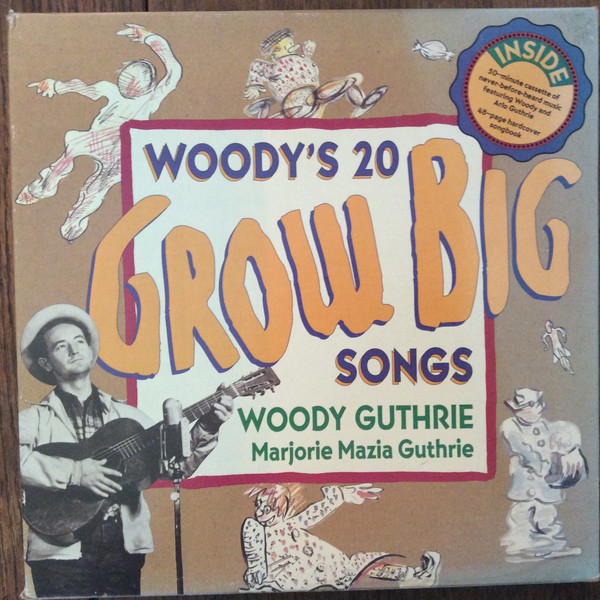

# Woody's 20 Grow Big Songs

By Woody Guthrie

## Album Data

[Discogs URL](https://www.discogs.com/release/9757427-Woody-Arlo-Guthrie-And-The-Guthrie-Family-Woodys-20-Grow-Big-Songs)

- Label: Rising Son Records, Inc.
- Formats: Cassette
- Genres: Children's, Folk, World, & Country, Folk
- Rating: 0
- Released: 1992
- Year: 1992
- Release ID: 9757427
- Media condition: 
- Sleeve condition: 
- Speed: 
- Weight: 
- Notes: 

## Album Tracks

| **Position** | **Title** | **Duration** |
|--------------|-----------|--------------|
| A1 | **Wake Up** |  |
| A2 | **Cleano** |  |
| A3 | **Mailman** |  |
| A4 | **Put Your Finger In The Air** |  |
| A5 | **Dance Around** |  |
| A6 | **Don't You Push Me Down** |  |
| A7 | **Merry Go Round** |  |
| A8 | **Jig Along Home** |  |
| A9 | **Howdy Doo** |  |
| A10 | **All Work Together** |  |
| B1 | **Bling Blang** |  |
| B2 | **Needle Sing** |  |
| B3 | **Pick It Up** |  |
| B4 | **Riding In My Car** |  |
| B5 | **Race You Down The Mountain** |  |
| B6 | **My Dolly** |  |
| B7 | **Little Seed** |  |
| B8 | **Little Bird** |  |
| B9 | **Pretty And Shinyo** |  |
| B10 | **Sleep Eye** |  |

