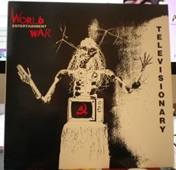

# Televisionary

By World Entertainment War

## Album Data

[Discogs URL](https://www.discogs.com/release/3844654-World-Entertainment-War-Televisionary)

- Label: Infomania Records
- Formats: Vinyl, LP
- Genres: Rock
- Rating: 3.67
- Released: 1989
- Year: 1989
- Release ID: 3844654
- Media condition: 
- Sleeve condition: 
- Speed: 
- Weight: 
- Notes: 

## Album Tracks

| **Position** | **Title** | **Duration** |
|--------------|-----------|--------------|
| A1 | **Marlboro Man, Jr.** | 4:25 |
| A2 | **Left Hand Fights The Right** | 4:09 |
| A3 | **Dance Your Monster** | 4:05 |
| A4 | **Purity Test, Part 1** | 1:40 |
| A5 | **Televisonary** | 6:08 |
| B1 | **K-Mart Tribal Ballet** | 4:42 |
| B2 | **Cooked Intelligence** | 4:12 |
| B3 | **I Dropped Out Of Kindergarten** | 3:51 |
| B4 | **Purity Test, Part 2** | 0:44 |
| B5 | **Triple Witching Hour** | 6:58 |

## Artist Roles

| **Name** | **Role** |
|----------|----------|
| **Daniel Lewis (2)** | Bass |
| **Anthony Guess** | Drums |
| **"Razor" James** | Engineer |
| **David Plank** | Engineer |
| **Paul Mandl** | Engineer, Producer |
| **George Earth** | Guitar |
| **Amy Excolere** | Keyboards |
| **Wendy Bardsley** | Mixed By, Engineer |
| **Andy Murdock** | Mixed By, Engineer, Producer |
| **David Plank** | Mixed By, Producer, Engineer |
| **Clay Holden** | Photography By [Band Members] |
| **Steve Gladstone** | Photography By [Band Members] |
| **Steve Gladstone** | Photography By [of Televisonary Idol] |
| **David Plank** | Producer |
| **Darby Gould** | Vocals |
| **Rob Brezsny** | Vocals, Design Concept |
| **World Entertainment War** | Written-By, Arranged By, Producer |

