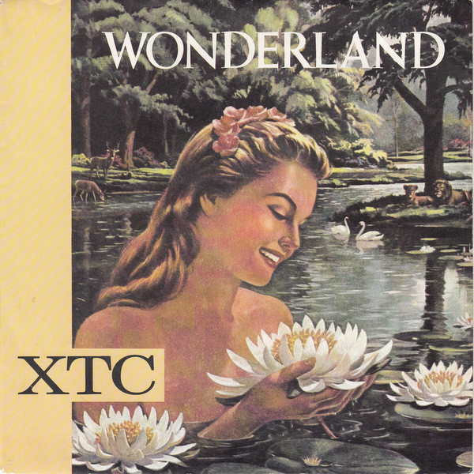

# Wonderland

By XTC

## Album Data

[Discogs URL](https://www.discogs.com/release/1453543-XTC-Wonderland)

- Label: Virgin
- Formats: Vinyl, 7", Single, 45 RPM
- Genres: Rock, Pop, Indie Rock, New Wave
- Rating: 4.29
- Released: 1983
- Year: 1983
- Release ID: 1453543
- Media condition: 
- Sleeve condition: 
- Speed: 
- Weight: 
- Notes: 

## Album Tracks

| **Position** | **Title** | **Duration** |
|--------------|-----------|--------------|
| A | **Wonderland** |  |
| B | **Jump** |  |

## Artist Roles

| **Name** | **Role** |
|----------|----------|
| **Steve Nye** | Producer |
| **XTC** | Producer |

