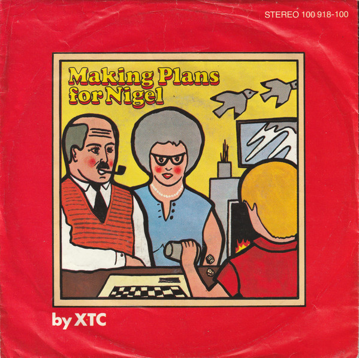

# Making Plans For Nigel

By XTC

## Album Data

[Discogs URL](https://www.discogs.com/release/585246-XTC-Making-Plans-For-Nigel)

- Label: Virgin
Virgin
- Formats: Vinyl, 7", Single
- Genres: Rock, New Wave, Pop Rock
- Rating: 4.15
- Released: 1979
- Year: 1979
- Release ID: 585246
- Media condition: 
- Sleeve condition: 
- Speed: 
- Weight: 
- Notes: 

## Album Tracks

| **Position** | **Title** | **Duration** |
|--------------|-----------|--------------|
| A | **Making Plans For Nigel** | 3:54 |
| B1 | **Buschman President** | 3:10 |
| B2 | **Pulsing Pulsing** | 1:36 |

## Artist Roles

| **Name** | **Role** |
|----------|----------|
| **Hugh Padgham** | Engineer |
| **Steve Shotter** | Illustration [Illustrations] |
| **Steve Lillywhite** | Producer |
| **Cooke Key** | Sleeve |
| **George Chambers** | Tape Op |

