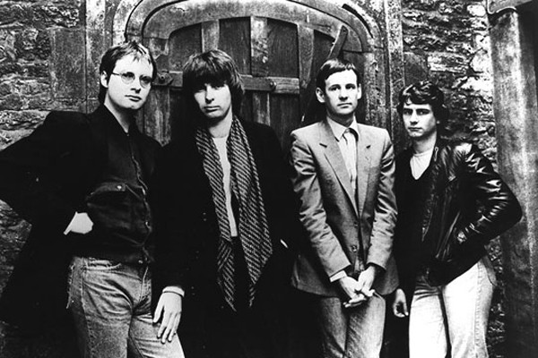

# XTC

## Artist Profile

Formed: Swindon, Wiltshire, United Kingdom, active 1975-2006. From the ashes of the band The Helium Kidz.
Musically adventurous group from Swindon, UK, who first made an impact as a post-punk new wave band but have refused to be pigeonholed, recording dub, folk-rock, psychedelia and pure pop as the mood takes them. Regular line-up was Andy Partridge (guitar & vocals), Colin Moulding (bass & vocals), Barry Andrews (keyboards, left in 1979), Dave Gregory (guitar & keyboards) and Terry Chambers (drums, left in 1983).

## Artist Links

- [http://chalkhills.org/](http://chalkhills.org/)
- [http://www.ape.uk.net/](http://www.ape.uk.net/)
- [http://en.wikipedia.org/wiki/XTC](http://en.wikipedia.org/wiki/XTC)
- [http://www.10ft.it/album_boot.html](http://www.10ft.it/album_boot.html)

## See also

- [Making Plans For Nigel](Making_Plans_For_Nigel.md)
- [The Loving](The_Loving.md)
- [Wake Up](Wake_Up.md)
- [Wonderland](Wonderland.md)
