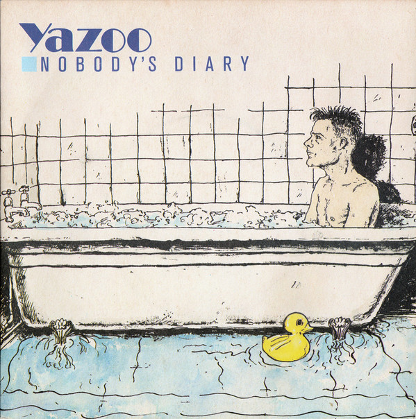

# Nobody's Diary

By Yazoo

## Album Data

[Discogs URL](https://www.discogs.com/release/2460244-Yaz-Nobodys-Diary)

- Label: Sire
Mute
- Formats: Vinyl, 7", Single
- Genres: Electronic, Synth-pop
- Rating: 4.33
- Released: 1983
- Year: 1983
- Release ID: 2460244
- Media condition: 
- Sleeve condition: 
- Speed: 
- Weight: 
- Notes: 

## Album Tracks

| **Position** | **Title** | **Duration** |
|--------------|-----------|--------------|
| A | **Nobody's Diary** | 3:58 |
| B | **State Farm** | 3:34 |

## Artist Roles

| **Name** | **Role** |
|----------|----------|
| **Eric Radcliffe** | Producer |
| **Yazoo** | Producer |

