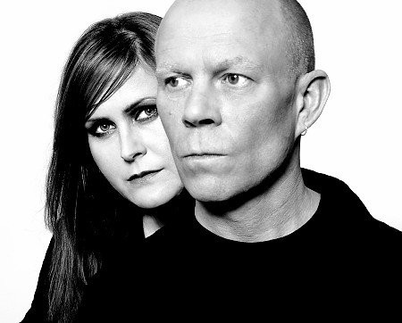

# Yazoo

## Artist Profile

Yazoo (known as Yaz in North America) was an English synthpop duo from Basildon, Essex. They had a number of top ten hits in the British charts in the early 1980s. Formed in late 1981 by former Depeche Mode songwriter Vince Clarke (synthesizer) and English singer Alison Moyet (vocals), Yazoo was signed to Mute Records Ltd. who licensed them (as "Yaz") to Sire Records Company in the USA. In an interview Vince Clark admitted the band name "Yazoo" name came from the record label Yazoo.

## Artist Links

- [https://yazooinfo.com/](https://yazooinfo.com/)
- [https://yazooinfo.com/backintime/index.html](https://yazooinfo.com/backintime/index.html)
- [https://twitter.com/yazooinfo](https://twitter.com/yazooinfo)
- [https://myspace.com/yazooofficial](https://myspace.com/yazooofficial)
- [https://en.wikipedia.org/wiki/Yazoo_(band)](https://en.wikipedia.org/wiki/Yazoo_(band))

## See also

- [Nobody's Diary](Nobodys_Diary.md)
