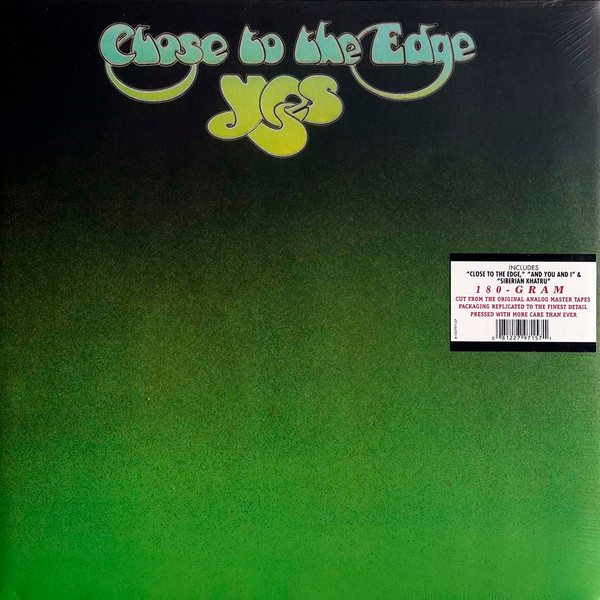

# Close To The Edge

By Yes

## Album Data

[Discogs URL](https://www.discogs.com/release/4070858-Yes-Close-To-The-Edge)

- Label: Atlantic
- Formats: Vinyl, LP, Album, Limited Edition, Reissue
- Genres: Rock, Prog Rock, Art Rock, Symphonic Rock
- Rating: 4.64
- Released: 2012
- Year: 1972
- Release ID: 4070858
- Media condition: 
- Sleeve condition: 
- Speed: 
- Weight: 
- Notes: 

## Album Tracks

| **Position** | **Title** | **Duration** |
|--------------|-----------|--------------|
|  | **Close To The Edge** | 18:50 |
|  | **And You And I** | 10:09 |
| B2 | **Siberian Khatru** | 8:57 |

## Artist Roles

| **Name** | **Role** |
|----------|----------|
| **Yes** | Arranged By |
| **Chris Squire** | Bass, Vocals |
| **Brian Lane (3)** | Coordinator |
| **Roger Dean (4)** | Cover, Photography By |
| **Steve Howe** | Guitar, Vocals |
| **Rick Wakeman** | Keyboards |
| **Chris Bellman** | Lacquer Cut By |
| **Bill Bruford** | Percussion |
| **Martin Adelman** | Photography By |
| **Eddy Offord** | Producer |
| **Yes** | Producer |
| **Mike Dunne** | Tape Op [Tapes] |
| **Jon Anderson** | Vocals |

