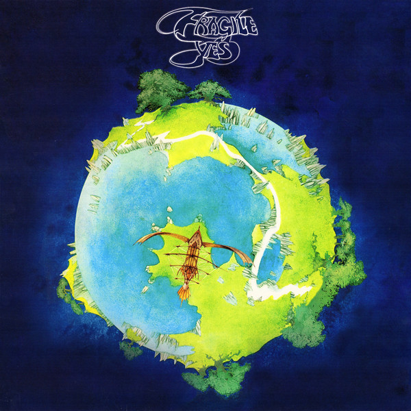

# Fragile

By Yes

## Album Data

[Discogs URL](https://www.discogs.com/release/8515237-Yes-Fragile)

- Label: Atlantic
- Formats: Vinyl, LP, Album, Reissue
- Genres: Rock, Prog Rock, Art Rock, Symphonic Rock
- Rating: 4.7
- Released: 2016-05-13
- Year: 1971
- Release ID: 8515237
- Media condition: 
- Sleeve condition: 
- Speed: 
- Weight: 
- Notes: 

## Album Tracks

| **Position** | **Title** | **Duration** |
|--------------|-----------|--------------|
| A1 | **Roundabout** | 8:29 |
| A2 | **Cans And Brahms (Extracts From Brahms' 4th Symphony In E Minor, Third Movement)** | 1:35 |
| A3 | **We Have Heaven** | 1:30 |
| A4 | **South Side Of The Sky** | 8:04 |
| B1 | **Five Percent For Nothing** | 0:35 |
| B2 | **Long Distance Runaround** | 3:33 |
| B3 | **The Fish (Schindleria Praematurus)** | 2:35 |
| B4 | **Mood For A Day** | 2:57 |
| B5 | **Heart Of The Sunrise** | 10:34 |

## Artist Roles

| **Name** | **Role** |
|----------|----------|
| **Roger Dean (4)** | Artwork [Sleeve Drawings], Photography By |
| **Chris Squire** | Bass Guitar, Vocals |
| **Bill Bruford** | Drums, Percussion |
| **Steve Howe** | Electric Guitar, Acoustic Guitar, Vocals |
| **Gary Martin (3)** | Engineer [Assistant] |
| **Kevin Gray** | Lacquer Cut By |
| **Rick Wakeman** | Organ, Grand Piano, Electric Piano, Harpsichord, Mellotron, Synthesizer |
| **David Wright (16)** | Photography By [Colour Photo Of Bill Bruford On Drums] |
| **Yes** | Producer |
| **Eddy Offord** | Producer, Engineer |
| **Jon Anderson** | Vocals |

