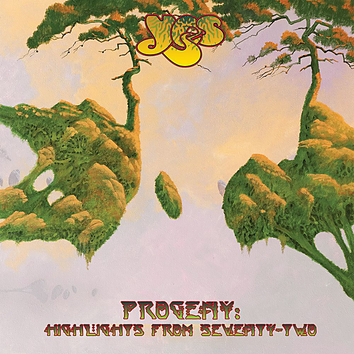

# Progeny: Highlights From Seventy-Two

By Yes

## Album Data

[Discogs URL](https://www.discogs.com/release/7116500-Yes-Progeny-Highlights-From-Seventy-Two)

- Label: Rhino Records (2)
Atlantic
- Formats: Vinyl, LP, Album
- Genres: Rock, Symphonic Rock, Prog Rock
- Rating: 4.52
- Released: 2015-05-22
- Year: 2015
- Release ID: 7116500
- Media condition: 
- Sleeve condition: 
- Speed: 
- Weight: 
- Notes: 

## Album Tracks

| **Position** | **Title** | **Duration** |
|--------------|-----------|--------------|
| A1 | **Opening (Excerpt From Firebird Suite) / Siberian Khatru** |  |
|  | **I've Seen All Good People** |  |
| B1 | **Heart Of The Sunrise** |  |
| B2 | **Clap / Mood For A Day** |  |
|  | **And You And I** |  |
|  | **Close To The Edge** |  |
| E1 | **Excerpts From "The Six Wives Of Henry VIII"** |  |
| E2 | **Roundabout** |  |
| F | **Yours Is No Disgrace** |  |

## Artist Roles

| **Name** | **Role** |
|----------|----------|
| **Chris Squire** | Bass, Vocals |
| **Alan White** | Drums |
| **Rick Wakeman** | Keyboards |
| **Steve Howe** | Vocals, Guitar |
| **Jon Anderson** | Vocals, Percussion |

