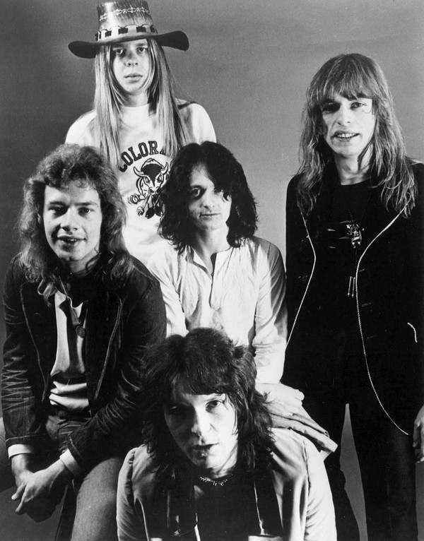

# Yes

## Artist Profile

Yes are an English rock band who achieved worldwide success with their progressive, art, and symphonic style of rock music. Regarded as one of the pioneers of the progressive genre, Yes are known for their lengthy songs, mystical lyrics, elaborate album art, and live stage sets. No fewer than 18 musicians have been a part of the band's line-up, with its current form comprising singer Jon Davison, bassist Billy Sherwood, guitarist Steve Howe, drummer Alan White, and keyboardist Geoff Downes.

## Artist Links

- [http://www.yesworld.com/](http://www.yesworld.com/)
- [https://www.facebook.com/yestheband/](https://www.facebook.com/yestheband/)
- [https://twitter.com/yesofficial](https://twitter.com/yesofficial)
- [https://www.instagram.com/yesofficial/](https://www.instagram.com/yesofficial/)
- [https://www.youtube.com/yesofficial](https://www.youtube.com/yesofficial)
- [https://soundcloud.com/yesofficial/](https://soundcloud.com/yesofficial/)
- [http://www.nfte.org/](http://www.nfte.org/)
- [https://www.facebook.com/NotesFromtheEdge](https://www.facebook.com/NotesFromtheEdge)
- [https://en.wikipedia.org/wiki/Yes_(band)](https://en.wikipedia.org/wiki/Yes_(band))
- [http://www.progarchives.com/artist.asp?id=105](http://www.progarchives.com/artist.asp?id=105)

## See also

- [Close To The Edge](Close_To_The_Edge.md)
- [Fragile](Fragile.md)
- [Progeny](Progeny-_Highlights_From_Seventy-Two.md)
- [The Yes Album](The_Yes_Album.md)
- [Yessongs](Yessongs.md)
