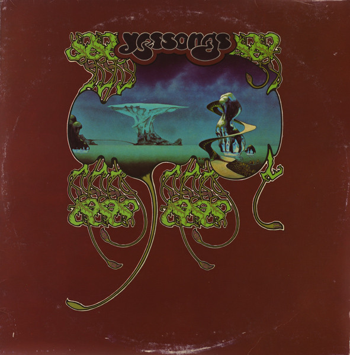

# Yessongs

By Yes

## Album Data

[Discogs URL](https://www.discogs.com/release/785287-Yes-Yessongs)

- Label: Atlantic
- Formats: Vinyl, LP, Album, Stereo
- Genres: Rock, Prog Rock
- Rating: 4.09
- Released: 1973-05-18
- Year: 1973
- Release ID: 785287
- Media condition: 
- Sleeve condition: 
- Speed: 
- Weight: 
- Notes: 

## Album Tracks

| **Position** | **Title** | **Duration** |
|--------------|-----------|--------------|
| A1 | **Opening (Excerpt From "Firebird Suite")** | 3:45 |
| A2 | **Siberian Khatru** | 8:50 |
| A3 | **Heart Of The Sunrise** | 11:26 |
| B1 | **Perpetual Change** | 14:08 |
|  | **And You & I** | 9:55 |
| C1 | **Mood For A Day** | 2:52 |
| C2 | **Excerpts From "The Six Wives Of Henry VIII"** | 6:35 |
| C3 | **Roundabout** | 8:33 |
| D1.a | **Your Move** | 7:00 |
| D1.b | **All Good People** |  |
| D2.a | **Long Distance Runaround** | 13:45 |
| D2.b | **The Fish (Schindleria Praimaturus)** |  |
|  | **Close To The Edge** | 18:41 |
| F1 | **Yours Is No Disgrace** | 14:21 |
|  | **Starship Trooper** | 9:25 |

## Artist Roles

| **Name** | **Role** |
|----------|----------|
| **Brian Lane (3)** | Coordinator |
| **Roger Dean (4)** | Cover [Cover Design], Design [Cover Design], Illustration |
| **Mike Dunne** | Engineer [Assistant] |
| **Geoffrey Haslam** | Engineer [Recording] |
| **George Piros** | Mastered By, Lacquer Cut By |
| **Alan White** | Performer |
| **Bill Bruford** | Performer |
| **Chris Squire** | Performer |
| **Jon Anderson** | Performer |
| **Rick Wakeman** | Performer |
| **Steve Howe** | Performer |
| **David Gahr** | Photography By [Additional] |
| **Martyn Dean** | Photography By, Layout |
| **Eddy Offord** | Producer |
| **Yes** | Producer |

