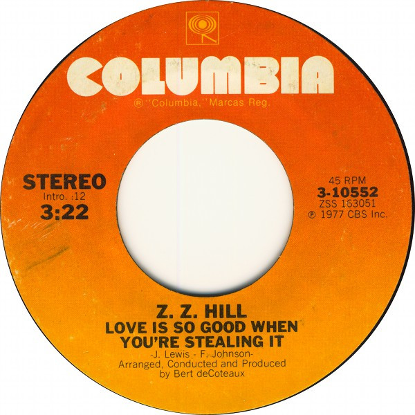

# Love Is So Good When You're Stealing It

By Z.Z. Hill

## Album Data

[Discogs URL](https://www.discogs.com/release/2356120-Z-Z-Hill-Love-Is-So-Good-When-Youre-Stealing-It)

- Label: Columbia
- Formats: Vinyl, 7", 45 RPM, Single, Styrene, Stereo
- Genres: Funk / Soul, Soul
- Rating: 4.63
- Released: 1977
- Year: 1977
- Release ID: 2356120
- Media condition: 
- Sleeve condition: 
- Speed: 
- Weight: 
- Notes: 

## Album Tracks

| **Position** | **Title** | **Duration** |
|--------------|-----------|--------------|
| A | **Love Is So Good When You're Stealing It** | 3:22 |
| B | **Need You By My Side** | 3:59 |

## Artist Roles

| **Name** | **Role** |
|----------|----------|
| **Bert DeCoteaux** | Arranged By, Conductor, Producer |
| **Ray Janos** | Mastered By |

