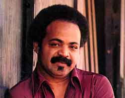

# Z.Z. Hill

## Artist Profile

His alias / stage name was a homage to B.B. King. Pronounced Zee Zee Hill, he was an American blues and soul singer, born 30th September 1935 in Naples, Texas, U.S.A., died 27th April 1984. On the 23rd April 1984, he gave his last performance, at the Longhorn Ballroom in Dallas. Unfortunately four days later, he died from complications stemming from a blood clot that had formed in his leg which was attributed to the car accident he'd had in February of the same year whilst touring. He was buried in Gethsemane Cemetery in Naples, Texas.

## Artist Links

- [http://en.wikipedia.org/wiki/Z.Z._Hill](http://en.wikipedia.org/wiki/Z.Z._Hill)
- [http://www.whosampled.com/Z.Z.-Hill/](http://www.whosampled.com/Z.Z.-Hill/)

## See also

- [Love Is So Good When You're Stealing It](Love_Is_So_Good_When_Youre_Stealing_It.md)
