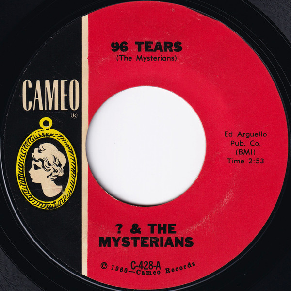

# 96 Tears

By ? & The Mysterians

## Album Data

[Discogs URL](https://www.discogs.com/release/3241067--The-Mysterians-96-Tears)

- Label: Cameo
- Formats: Vinyl, 7", 45 RPM, Single, Styrene
- Genres: Rock, Rock & Roll, Garage Rock
- Rating: 4.48
- Released: 1966
- Year: 1966
- Release ID: 3241067
- Media condition: 
- Sleeve condition: 
- Speed: 
- Weight: 
- Notes: 

## Album Tracks

| **Position** | **Title** | **Duration** |
|--------------|-----------|--------------|
| A | **96 Tears** | 2:53 |
| B | **Midnight Hour** | 2:21 |

## Artist Roles

| **Name** | **Role** |
|----------|----------|
| **? & The Mysterians** | Written-By |

