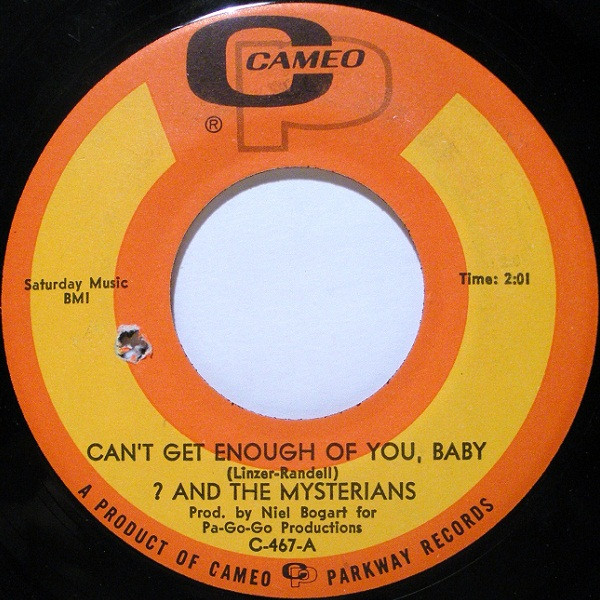

# Can't Get Enough Of You, Baby

By ? & The Mysterians

## Album Data

[Discogs URL](https://www.discogs.com/release/2028267--And-The-Mysterians-Cant-Get-Enough-Of-You-Baby)

- Label: Cameo
- Formats: Vinyl, 45 RPM, Single, 7"
- Genres: Rock, Garage Rock, Pop Rock
- Rating: 4.59
- Released: 1967
- Year: 1967
- Release ID: 2028267
- Media condition: 
- Sleeve condition: 
- Speed: 
- Weight: 
- Notes: 

## Album Tracks

| **Position** | **Title** | **Duration** |
|--------------|-----------|--------------|
| A | **Can't Get Enough Of You, Baby** | 2:01 |
| B | **Smokes** | 1:56 |

## Artist Roles

| **Name** | **Role** |
|----------|----------|
| **Jack Adams** | Lacquer Cut By |
| **Neil Bogart** | Producer |

