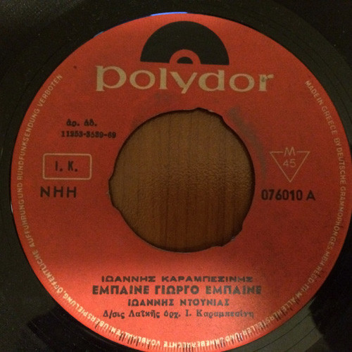

# Έμπαινε Γιώργο Έμπαινε / Στης Πλάκας Της Ανηφοριές

By Γιάννης Ντουνιάς

## Album Data

[Discogs URL](https://www.discogs.com/release/5284114-%CE%99%CF%89%CE%AC%CE%BD%CE%BD%CE%B7%CF%82-%CE%9D%CF%84%CE%BF%CF%85%CE%BD%CE%B9%CE%AC%CF%82-%CE%99%CF%89%CE%AC%CE%BD%CE%BD%CE%B7%CF%82-%CE%9A%CE%B1%CF%81%CE%B1%CE%BC%CF%80%CE%B5%CF%83%CE%AF%CE%BD%CE%B7%CF%82-%CE%88%CE%BC%CF%80%CE%B1%CE%B9%CE%BD%CE%B5-%CE%93%CE%B9%CF%8E%CF%81%CE%B3%CE%BF-)

- Label: Polydor
- Formats: Vinyl, 7", 45 RPM, Single
- Genres: Folk, World, & Country, Laïkó
- Rating: 3
- Released: 1969
- Year: 1969
- Release ID: 5284114
- Media condition: 
- Sleeve condition: 
- Speed: 
- Weight: 
- Notes: 

## Album Tracks

| **Position** | **Title** | **Duration** |
|--------------|-----------|--------------|
| A | **Έμπαινε Γιώργο Έμπαινε** |  |
| B | **Στης Πλάκας Της Ανηφοριές** |  |

## Artist Roles

| **Name** | **Role** |
|----------|----------|
| **Γιάννης Καραμπεσίνης** | Directed By [Λαϊκής όρχ.] |
| **Γιάννης Καραμπεσίνης** | Songwriter |

