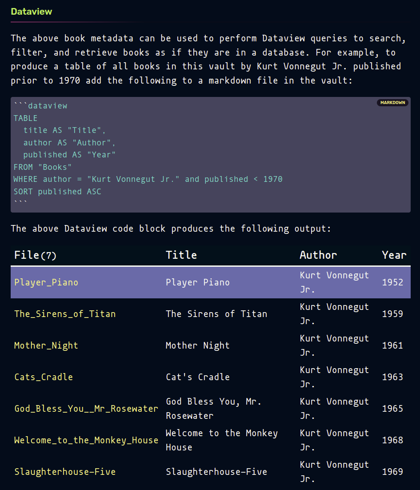

# Obsidian Media Vault

This repository is organized as an Obsidian vault containing Media descriptions in markdown format. It can be viewed using any markdown viewer (e.g. almost any browser) but if Obsidian is used then many additional features will be available including queries using the [Dataview](https://blacksmithgu.github.io/obsidian-dataview/) plugin for [Obsidian](https://obsidian.md/).

The `Obsidian-Media-Vault` repository reflects the partial contents of my personal library of books, cds, and records. As such, it may be relevant only to a few. However, the process by which this repository was created and curated as well as the tools used in its creation and curation may be useful to a wider audience. I am making it public and freely licensed so that others may examine, adapt, clone, and use in whatever manner they choose. See the [description of Process](Process.md) for an overview of the process and tools employed in the creation of this repository.

## Usage

### **For the optimal experience, open this vault in Obsidian!**

1. [Download the vault](https://github.com/doctorfree/Obsidian-Media-Vault/releases/latest)
3. Open the vault in Obsidian via "Open another vault -> Open folder as vault"
4. Trust us. :) 
5. When Obsidian opens the settings, hit the switch on "Dataview" to enable the plugin
6. Done! The Obsidian Media Vault is now available to you in its purest and most useful form!

## Dataview

The Obsidian Media Vault has been curated with metadata allowing queries to be performed using the Obsidian Dataview plugin. Sample queries along with the code used to perform them can be viewed in the [Media Queries](Media_Queries.md) document.

The Obsidian Media Vault markdown contains metadata with tags allowing a variety of Obsidian Dataview queries. For example, the markdown of the book "Timequake" by Kurt Vonnegut Jr. has the following YAML prelude:

```yaml
---
bookid: 9594
title: Timequake
author: Kurt Vonnegut Jr.
authors: 
isbn: 0099267543
isbn13: 9780099267546
rating: 4
avgrating: 3.72
publisher: Vintage Classics
binding: Paperback
pages: 219
published: 1997
shelves: science-fiction, novels, vonnegut
shelf: read
review: 
---
```

The above book metadata can be used to perform Dataview queries to search, filter, and retrieve books as if they are in a database. For example, to produce a table of all books in this vault by Kurt Vonnegut Jr. published prior to 1970 add the following to a markdown file in the vault:

````markdown
```dataview
TABLE
  title AS "Title",
  author AS "Author",
  published AS "Year"
FROM "Books"
WHERE author = "Kurt Vonnegut Jr." and published < 1970
SORT published ASC
```
````

### Screenshot of example Media Vault Dataview query



Sample queries along with the code used to perform them can be viewed in the [Media Queries](Media_Queries.md) document.

## Books

The 'Books' subfolder of this Obsidian vault was created by exporting my Goodreads library of books to CSV. I then used [csvkit](https://csvkit.readthedocs.io/en/latest) and command line tools to convert the CSV format Goodreads data to Markdown. Each Markdown document created in this way contains extensive metadata that can be used to query the vault with Dataview.

See the [Process section below](#process) for details on this vault setup procedure.

## Structure

The Books sub-vault is organized by author subfolders. For example, all books by Kurt Vonnegut Jr. are in the `Books/Kurt_Vonnegut_Jr/` folder.

## Process

See the [Process](Process.md) document for a detailed description of the tools and process used to generate this vault.

## See also

- [Media Queries](Media_Queries.md)
- [Process](Process.md)


