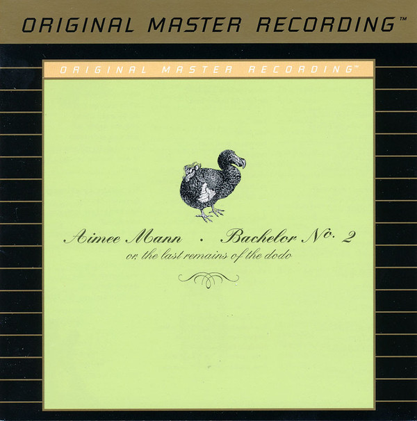

# Bachelor No. 2 (Or, The Last Remains of the Dodo)

By Aimee Mann

## Album Data

- Catalog #: Roon
- Format: Digital, Album

## Track listing

1. How I Am Different
2. Nothing Is Good Enough
3. Red Vines
4. The Fall of the World's Own Optimist
5. Satellite
6. Deathly
7. Ghost World
8. Calling It Quits
9. Driving Sideways
10. Just Like Anyone
11. Susan
12. It Takes All Kinds
13. You Do

## See also

- [Bachelor, No. 2 (Or, The Last Remains of the Dodo) (20th Anniversary Edition)](Bachelor__No_2_Or__The_Last_Remains_of_the_Dodo_20th_Anniversary_Edition.md)
- [I'm With Stupid](Im_With_Stupid.md)
- [Lost In Space](Lost_In_Space.md)
- [Mental Illness](Mental_Illness.md)
- [Whatever](Whatever.md)
- [Beets: Bachelor No. 2](../../Beets/Aimee_Mann/Bachelor_No_2.md)
- [Beets: I'm With Stupid](../../Beets/Aimee_Mann/Im_With_Stupid.md)
