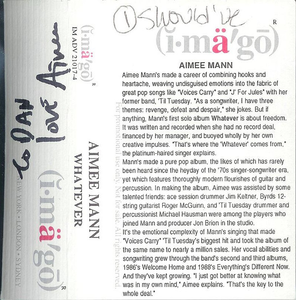

# Whatever

By Aimee Mann

## Album Data

- Catalog #: Roon
- Format: Digital, Album

## Track listing

1. I Should've Known
2. Fifty Years After the Fair
3. 4th of July
4. Could've Been Anyone
5. Put Me on Top
6. Stupid Thing
7. Say Anything
8. Jacob Marley's Chain
9. Mr. Harris
10. I Could Hurt You Now
11. I Know There's a Word
12. I've Had It
13. Way Back When

## See also

- [Bachelor, No. 2 (Or, The Last Remains of the Dodo) (20th Anniversary Edition)](Bachelor__No_2_Or__The_Last_Remains_of_the_Dodo_20th_Anniversary_Edition.md)
- [Bachelor No. 2 (Or, The Last Remains of the Dodo)](Bachelor_No_2_Or__The_Last_Remains_of_the_Dodo.md)
- [I'm With Stupid](Im_With_Stupid.md)
- [Lost In Space](Lost_In_Space.md)
- [Mental Illness](Mental_Illness.md)
- [Beets: Bachelor No. 2](../../Beets/Aimee_Mann/Bachelor_No_2.md)
- [Beets: I'm With Stupid](../../Beets/Aimee_Mann/Im_With_Stupid.md)
