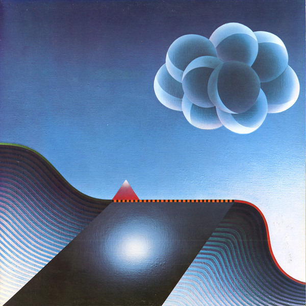

# The Best Of The Alan Parsons Project

By Alan Parsons

## Album Data

- Catalog #: Roon
- Format: Digital, Album

## Track listing

1. I Wouldn't Want to Be Like You
2. Eye in the Sky
3. Games People Play
4. Time
5. Pyramania
6. You Don't Believe
7. Lucifer
8. Psychobabble
9. Damned If I Do
10. Don't Let It Show
11. Can't Take It With You
12. Old and Wise

## See also

- [Eye In The Sky](Eye_In_The_Sky.md)
- [Pyramid (Expanded Edition)](Pyramid_Expanded_Edition.md)
- [Stereotomy (Expanded Edition)](Stereotomy_Expanded_Edition.md)
- [Tales Of Mystery And Imagination - Edgar Allan Poe (1987 Remix)](Tales_Of_Mystery_And_Imagination_-_Edgar_Allan_Poe_1987_Remix.md)
- [The Essential Alan Parsons Project](The_Essential_Alan_Parsons_Project.md)
- [The Turn Of A Friendly Card (Expanded Edition)](The_Turn_Of_A_Friendly_Card_Expanded_Edition.md)
- [Try Anything Once](Try_Anything_Once.md)
- [Beets: Try Anything Once](../../Beets/Alan_Parsons/Try_Anything_Once.md)
