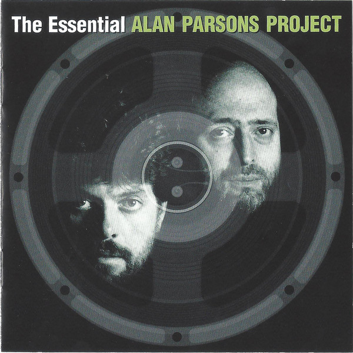

# The Essential Alan Parsons Project

By Alan Parsons

## Album Data

- Catalog #: Roon
- Format: Digital, Album

## Track listing

1-1 The Raven
1-2 (The System of) Dr. Tarr and Professor Fether
1-3 To One in Paradise
1-4 I Robot
1-5 I Wouldn't Want to Be Like You
1-6 Some Other Time
1-7 Day After Day (The Show Must Go on)
1-8 What Goes Up
1-9 The Eagle Will Rise Again
1-10 In the Lap of the Gods
1-11 Lucifer
1-12 Damned If I Do
1-13 Games People Play
1-14 Time
1-15 The Turn of a Friendly Card (Suite): The Turn of a Friendly Card
1-16 The Turn of a Friendly Card (Suite): Snake Eyes
1-17 The Turn of a Friendly Card (Suite): The Ace of Swords
1-18 The Turn of a Friendly Card (Suite): Nothing Left to Lose
1-19 The Turn of a Friendly Card (Suite): The Turn of a Friendly Card
2-1 Sirius
2-2 Eye in the Sky
2-3 Silence and I
2-4 Old and Wise
2-5 Mammagamma
2-6 Prime Time
2-7 Ammonia Avenue
2-8 Don't Answer Me
2-9 Let's Talk About Me
2-10 Days Are Numbers (The Traveller)
2-11 No Answers Only Questions
2-12 Stereotomy
2-13 Limelight
2-14 La Sagrada Familia
2-15 Standing on Higher Ground

