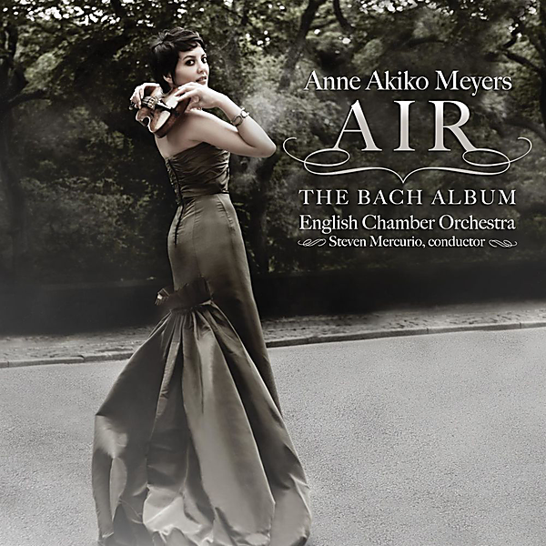

# Air: The Bach Album

By Anne Akiko Meyers

## Album Data

- Catalog #: Roon
- Format: Digital, Album

## Track listing

1. Orchestral Suite No. 3 in D major, BWV 1068: Air
2. Violin Concerto No. 1 in A minor, BWV 1041: 1. Allegro moderato
3. Violin Concerto No. 1 in A minor, BWV 1041: 2. Andante
4. Violin Concerto No. 1 in A minor, BWV 1041: 3. Allegro assai
5. Violin Concerto No. 2 in E major, BWV 1042: 1. Allegro
6. Violin Concerto No. 2 in E major, BWV 1042: 2. Adagio
7. Violin Concerto No. 2 in E major, BWV 1042: 3. Allegro assai
8. Concerto for harpischord in F minor, BWV 1056: Largo
9. Concerto for 2 violins, strings & continuo in D minor, BWV 1043: 1. Vivace
10. Concerto for 2 violins, strings & continuo in D minor, BWV 1043: 2. Largo ma non tanto
11. Concerto for 2 violins, strings & continuo in D minor, BWV 1043: 3. Allegro
12. Ave Maria

