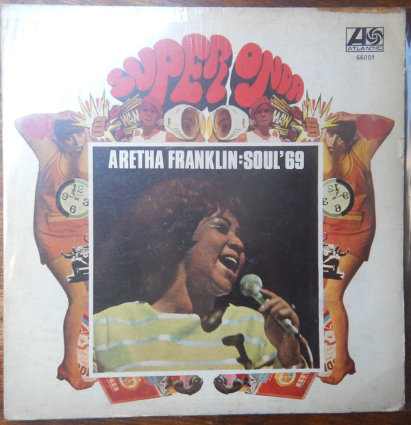

# Soul '69

By Aretha Franklin

## Album Data

- Catalog #: Roon
- Format: Digital, Album

## Track listing

1. Ramblin'
2. Today I Sing the Blues
3. River's Invitation
4. Pitiful
5. Crazy He Calls Me
6. Bring It on Home to Me
7. The Tracks of My Tears
8. If You Gotta Make a Fool of Somebody
9. Gentle on My Mind
10. So Long
11. I'll Never Be Free
12. Elusive Butterfly

## See also

- [Aretha In Person with The Ray Bryant Combo (Expanded Edition)](Aretha_In_Person_with_The_Ray_Bryant_Combo_Expanded_Edition.md)
- [Aretha](Aretha.md)
- [Aretha Now](Aretha_Now.md)
- [I Never Loved A Man The Way I Loved You](I_Never_Loved_A_Man_The_Way_I_Loved_You.md)
- [Lady Soul](Lady_Soul.md)
- [Spirit in the Dark](Spirit_in_the_Dark.md)
- [The Electrifying Aretha Franklin (Expanded Edition)](The_Electrifying_Aretha_Franklin_Expanded_Edition.md)
- [The Tender, The Moving, The Swinging Aretha Franklin (Expanded Edition)](The_Tender__The_Moving__The_Swinging_Aretha_Franklin_Expanded_Edition.md)
- [Young, Gifted and Black](Young__Gifted_and_Black.md)
- [Beets: Gospel Greats](../../Beets/Aretha_Franklin/Gospel_Greats.md)
- [Beets: I Never Loved a Man the Way I Love You](../../Beets/Aretha_Franklin/I_Never_Loved_a_Man_the_Way_I_Love_You.md)
- [Vinyl: ](../../Vinyl/Aretha_Franklin/Aretha_Franklin.md)
- [Vinyl: Freeway Of Love](../../Vinyl/Aretha_Franklin/Freeway_Of_Love.md)
