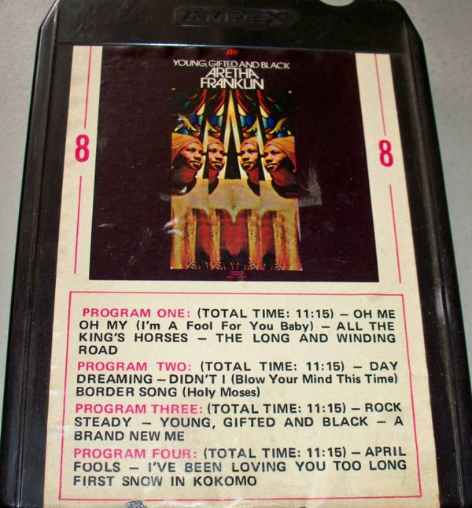

# Young, Gifted and Black

By Aretha Franklin

## Album Data

- Catalog #: Roon
- Format: Digital, Album

## Track listing

1. Oh Me Oh My (I'm a Fool for You Baby)
2. Day Dreaming
3. Rock Steady
4. Young, Gifted and Black
5. All The King's Horses
6. A Brand New Me
7. April Fools
8. I've Been Loving You Too Long
9. First Snow in Kokomo
10. The Long and Winding Road
11. Didn't I (Blow Your Mind This Time)
12. Border Song (Holy Moses)

## See also

- [Aretha In Person with The Ray Bryant Combo (Expanded Edition)](Aretha_In_Person_with_The_Ray_Bryant_Combo_Expanded_Edition.md)
- [Aretha](Aretha.md)
- [Aretha Now](Aretha_Now.md)
- [I Never Loved A Man The Way I Loved You](I_Never_Loved_A_Man_The_Way_I_Loved_You.md)
- [Lady Soul](Lady_Soul.md)
- [Soul '69](Soul_69.md)
- [Spirit in the Dark](Spirit_in_the_Dark.md)
- [The Electrifying Aretha Franklin (Expanded Edition)](The_Electrifying_Aretha_Franklin_Expanded_Edition.md)
- [The Tender, The Moving, The Swinging Aretha Franklin (Expanded Edition)](The_Tender__The_Moving__The_Swinging_Aretha_Franklin_Expanded_Edition.md)
- [Beets: Gospel Greats](../../Beets/Aretha_Franklin/Gospel_Greats.md)
- [Beets: I Never Loved a Man the Way I Love You](../../Beets/Aretha_Franklin/I_Never_Loved_a_Man_the_Way_I_Love_You.md)
- [Vinyl: ](../../Vinyl/Aretha_Franklin/Aretha_Franklin.md)
- [Vinyl: Freeway Of Love](../../Vinyl/Aretha_Franklin/Freeway_Of_Love.md)
