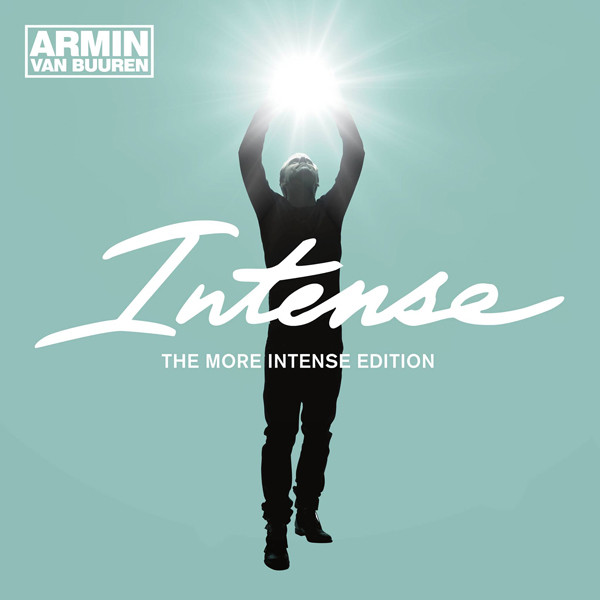

# Intense (The More Intense Edition)

By Armin van Buuren

## Album Data

- Catalog #: Roon
- Format: Digital, Album

## Track listing

1-1 Intense
1-2 This Is What It Feels Like
1-3 Beautiful Lie
1-4 Waiting for the Night
1-5 Pulsar
1-6 Sound of the Drums
1-7 Alone
1-8 Turn This Love Around
1-9 Won't Let You Go
1-10 In 10 Years from Now
1-11 Last Stop Before Heaven
1-12 Forever Is Ours
1-13 Love Never Came
1-14 Who's Afraid of 138?!
1-15 Reprise
1-16 This is What It Feels Like [John Ewbank Classical Remix]
2-1 Save My Night
2-2 Don't Want To Fight Love Away
2-3 Intense [Andrew Rayel Radio Edit]
2-4 This is What It Feels Like [W&W Radio Edit]
2-5 Beautiful Life [Kat Krazy Radio Edit]
2-6 Pulsar [Ummet Ozcan Radio Edit]
2-7 Sound of the Drums [Michael Brun Radio Edit]
2-8 Alone [Orjan Nilsen Radio Edit]
2-9 Turn This Love Around [Toby Hedges Radio Edit]
2-10 Won't Let You Go [Ian Standerwick Radio Edit]
2-11 Forever is Ours [Solarstone Pure Radio Edit]
2-12 Love Never Came [W&W vs. Armin van Buuren Remix]
2-13 Intense [Dannic Radio Edit]
2-14 Pulsar [Cosmic Gate Radio Edit]
2-15 Won't Let You Go [Tritonal Radio Edit]
2-16 Turn This Love Around [Starkillers Radio Edit]
2-17 Sound of the Drums [Aly & Fila Radio Edit]
2-18 Love Never Came [Jorn Van Deynhoven Radio Edit]
2-19 Last Stop Before Heaven [Maarten De Jong Radio Edit]
2-20 Love Never Came [The Blizzard Radio Edit]

