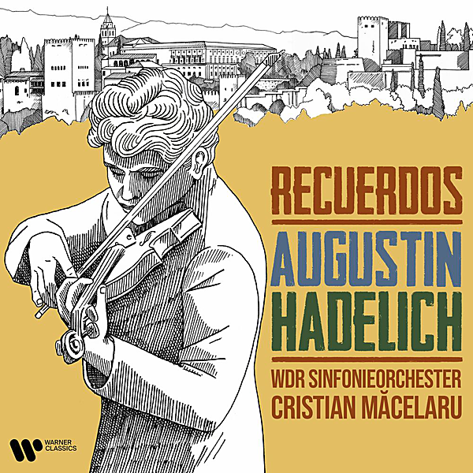

# Recuerdos

By Augustin Hadelich

## Album Data

- Catalog #: Roon
- Format: Digital, Album

## Track listing

1. Carmen Fantasy, Op. 25: Introduction. Allegro moderato
2. Carmen Fantasy, Op. 25: I. Moderato
3. Carmen Fantasy, Op. 25: II. Lento assai
4. Carmen Fantasy, Op. 25: III. Allegro moderato
5. Carmen Fantasy, Op. 25: IV. Moderato
6. Violin Concerto No. 2 in G minor, Op. 63: I. Allegro moderato
7. Violin Concerto No. 2 in G minor, Op. 63: II. Andante assai
8. Violin Concerto No. 2 in G minor, Op. 63: III. Allegro, ben marcato
9. Violin Concerto in D minor, Op. 15: I. Moderato con moto - Agitato - Tempo primo
10. Violin Concerto in D minor, Op. 15: II. Vivace - Animando - Largamento
11. Violin Concerto in D minor, Op. 15: III. Passacaglia. Andante lento (Un poco meno mosso)
12. Recuerdos de la Alhambra

