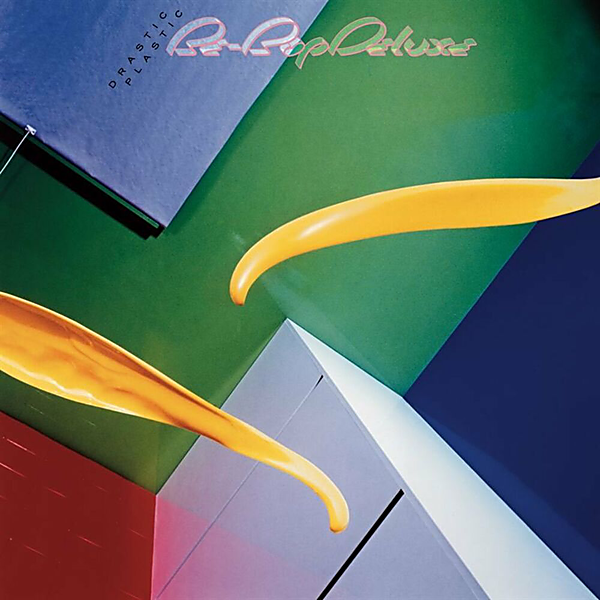

# Drastic Plastic (Deluxe Edition)

By Be Bop Deluxe

## Album Data

- Catalog #: Roon
- Format: Digital, Album

## Track listing

1. Electrical Language
2. New Precision
3. New Mysteries
4. Surreal Estate
5. Love in Flames
6. Panic in the World
7. Dangerous Stranger
8. Superenigmatix (Lethal Appliances for the Home With Everything)
9. Visions of Endless Hopes
10. Possession
11. Islands of the Dead
12. Japan
13. Futurist Manifesto
14. Panic in the World (single edit)
15. Blue as a Jewel
16. Electrical Language (single version)
17. Love in Flames (single version)
18. Face in the Rain
19. Islands of the Dead (take four)
20. The Saxophonist (Juan Les Pins version)
21. Autosexual
22. Lovers Are Mortal
23. Blimps
24. Speed of the Wind
25. Quest of Harvest for the Stars
26. New Precision (BBC Radio 1 Sight and Sound in Concert)
27. Superenigmatix (BBC Radio 1 Sight and Sound in Concert)
28. Possession (BBC Radio 1 Sight and Sound in Concert)
29. Dangerous Stranger (BBC Radio 1 Sight and Sound in Concert)
30. Islands of the Dead (BBC Radio 1 Sight and Sound in Concert)
31. Panic in the World (BBC Radio 1 Sight and Sound in Concert)
32. Lovers Are Mortal (BBC Radio 1 Sight and Sound in Concert)
33. Love in Flames (BBC Radio 1 Sight and Sound in Concert)
34. Blazing Apostles (BBC Radio 1 Sight and Sound in Concert)
35. Superenigmatix (BBC Radio 1 John Peel session)
36. Possession (BBC Radio 1 John Peel session)
37. Panic in the World (BBC Radio 1 John Peel session)
38. Love in Flames (BBC Radio 1 John Peel session)
39. Electrical Language (2021 stereo mix)
40. New Precision (2021 stereo mix)
41. New Mysteries (2021 stereo mix)
42. Surreal Estate (2021 stereo mix)
43. Love in Flames (2021 stereo mix)
44. Panic in the World (2021 stereo mix)
45. Dangerous Stranger (2021 stereo mix)
46. Superenigmatix (Lethal Appliances for the Home With Everything) (2021 stereo mix)
47. Visions of Endless Hope (2021 stereo mix)
48. Possession (2021 stereo mix)
49. Islands of the Dead (2021 stereo mix)
50. Japan (2021 stereo mix)
51. Futurist Manifesto (2021 stereo mix)
52. Blue as a Jewel (2021 stereo mix)
53. Autosexual (2021 stereo mix)
54. Face in the Rain (2021 stereo mix)
55. Lovers Are Mortal (2021 stereo mix)
56. Speed of the Wind (2021 stereo mix)
57. Quest for the Harvest of the Stars (2021 stereo mix)
58. Speed of the Wind (Bill Nelson demo, 1977)
59. Surreal Estate (Bill Nelson demo, 1977)
60. The Saxophonist (Bill Nelson demo, 1977)
61. Electrical Language (Bill Nelson demo, 1977)
62. Visions of Endless Hopes (Bill Nelson demo, 1977)
63. Possession (Bill Nelson demo, 1977)
64. Islands of the Dead (Bill Nelson demo, 1977)
65. New Mysteries (Bill Nelson demo, 1977)
66. Japan (Bill Nelson demo, 1977)
67. Dangerous Stranger (Bill Nelson demo, 1977)
68. Blue as a Jewel (Bill Nelson demo, 1977)
69. Autosexual (Bill Nelson demo, 1977)
70. Quest for the Harvest of the Stars (Bill Nelson demo, 1977)
71. New Precision (Bill Nelson demo, 1977)
72. Love in Flames (Bill Nelson demo, 1977)

