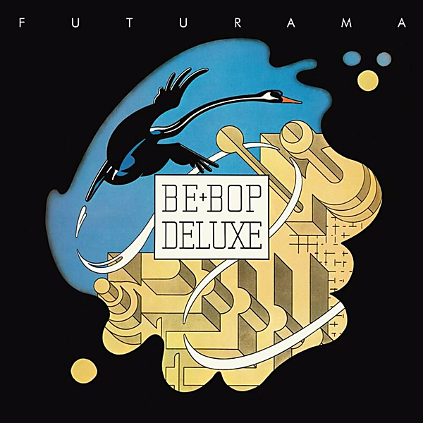

# Futurama (Remastered & Expanded)

By Be Bop Deluxe

## Album Data

- Catalog #: Roon
- Format: Digital, Album

## Track listing

1. Stage Whispers
2. Love With the Madman
3. Maid in Heaven
4. Sister Seagull
5. Sound Track
6. Music in Dreamland
7. Jean Cocteau
8. Between the Worlds
9. Swan Song
10. Between the Worlds (single version)
11. Lights
12. Stage Whispers (2019 stereo mix)
13. Love With the Madman (2019 stereo mix)
14. Maid in Heaven (2019 stereo mix)
15. Sister Seagull (2019 stereo mix)
16. Sound Track (2019 stereo mix)
17. Music in Dreamland (2019 stereo mix)
18. Jean Cocteau (2019 stereo mix)
19. Between the Worlds (2019 stereo mix)
20. Swan Song (2019 stereo mix)
21. Between the Worlds (single version) (2019 stereo mix)
22. Lights (2019 stereo mix)
23. Music in Dreamland (Phonogram Studios version)
24. Between the Worlds (alternate single version)
25. Stage Whispers (BBC Radio 1 "John Peel Show", 11 March 1975)
26. Sister Seagull (BBC Radio 1 "John Peel Show", 11 March 1975)
27. Maid in Heaven (BBC Radio 1 "John Peel Show", 11 March 1975)
28. Lights (BBC Radio 1 "John Peel Show", 11 March 1975)
29. Stage Whispers (BBC Radio 1 "In Concert", 23 May 1975)
30. Third Floor Heaven (BBC Radio 1 "In Concert", 23 May 1975)
31. Adventures in a Yorkshire Landscape (BBC Radio 1 "In Concert", 23 May 1975)
32. Sister Seagull (BBC Radio 1 "In Concert", 23 May 1975)
33. Piece of Mine (BBC Radio 1 "In Concert", 23 May 1975)
34. Maid in Heaven (BBC Radio 1 "In Concert", 23 May 1975)
35. Axe Victim (BBC Radio 1 "In Concert", 23 May 1975)

