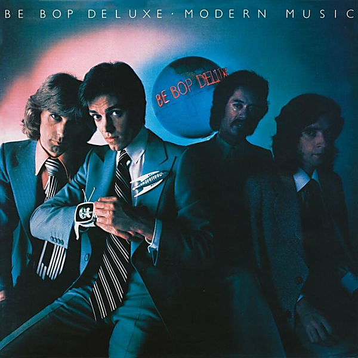

# Modern Music (Deluxe Edition)

By Be Bop Deluxe

## Album Data

- Catalog #: Roon
- Format: Digital, Album

## Track listing

1. Orphans of Babylon
2. Twilight Capers
3. Kiss of Light
4. The Bird Charmers Destiny
5. The Gold at the End of My Rainbow
6. Bring Back the Spark
7. Modern Music
8. Dancing in the Moonlight (All Alone)
9. Honeymoon on Mars
10. Lost in the Neon World
11. Dance of the Uncle Sam Humanoids
12. Modern Music (reprise)
13. Forbidden Lovers
14. Down on Terminal Street
15. Make the Music Magic
16. Shine
17. Orphans of Babylon (2019 stereo mix)
18. Twilight Capers (2019 stereo mix)
19. Kiss of Light (2019 stereo mix)
20. The Bird Charmers Destiny (2019 stereo mix)
21. The Gold at the End of My Rainbow (2019 stereo mix)
22. Bring Back the Spark (2019 stereo mix)
23. Modern Music (2019 stereo mix)
24. Dancing in the Moonlight (All Alone) (2019 stereo mix)
25. Honeymoon on Mars (2019 stereo mix)
26. Lost in the Neon World (2019 stereo mix)
27. Dance of the Uncle Sam Humanoids (2019 stereo mix)
28. Modern Music (reprise, 2019 stereo mix)
29. Forbidden Lovers (2019 stereo mix)
30. Down on Terminal Street (2019 stereo mix)
31. Make the Music Magic (2019 stereo mix)
32. Shine (2019 stereo mix)
33. Forbidden Lovers (first version)
34. The Bird Charmers Destiny (first version)
35. Maid in Heaven (BBC Radio 1 "In Concert", Hammersmith Odeon, London, 2 October 1976)
36. Bring Back the Spark (BBC Radio 1 "In Concert", Hammersmith Odeon, London, 2 October 1976)
37. Kiss of Light (BBC Radio 1 "In Concert", Hammersmith Odeon, London, 2 October 1976)
38. Adventures in a Yorkshire Landscape (BBC Radio 1 "In Concert", Hammersmith Odeon, London, 2 October 1976)
39. Fair Exchange (BBC Radio 1 "In Concert", Hammersmith Odeon, London, 2 October 1976)
40. Ships in the Night (BBC Radio 1 "In Concert", Hammersmith Odeon, London, 2 October 1976)
41. Twilight Capers (BBC Radio 1 "In Concert", Hammersmith Odeon, London, 2 October 1976)
42. Modern Music: Modern Music / Dancing in the Moonlight (All Alone) / Honeymoon on Mars / Lost in the Neon World / Dance of the Uncle Sam Humanoids / Modern Music (reprise) (BBC Radio 1 "In Concert", Hammersmith Odeon, London, 2 October 1976)
43. Blazing Apostles (BBC Radio 1 "In Concert", Hammersmith Odeon, London, 2 October 1976)
44. Fair Exchange (live, the Riviera Theatre, Chicago, 21 March 1976)
45. Stage Whispers (live, the Riviera Theatre, Chicago, 21 March 1976)
46. Life in the Air Age (live, the Riviera Theatre, Chicago, 21 March 1976)
47. Sister Seagull (live, the Riviera Theatre, Chicago, 21 March 1976)
48. Adventures in a Yorkshire Landscape (live, the Riviera Theatre, Chicago, 21 March 1976)
49. Maid in Heaven (live, the Riviera Theatre, Chicago, 21 March 1976)
50. Ships in the Night (live, the Riviera Theatre, Chicago, 21 March 1976)
51. Bill's Blues (live, the Riviera Theatre, Chicago, 21 March 1976)
52. Blazing Apostles (live, the Riviera Theatre, Chicago, 21 March 1976)

