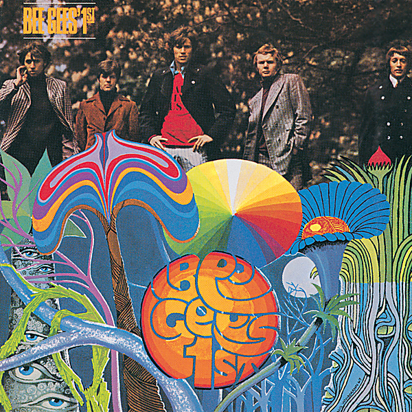

# Bee Gees 1st (Deluxe Version)

By Bee Gees

## Album Data

- Catalog #: Roon
- Format: Digital, Album

## Track listing

1. Turn of the Century
2. Holiday
3. Red Chair, Fade Away
4. One Minute Woman
5. In My Own Time
6. Every Christian Lion Hearted Man Will Show You
7. Craise Finton Kirk Royal Academy of Arts
8. New York Mining Disaster 1941
9. Cucumber Castle
10. To Love Somebody
11. I Close My Eyes
12. I Can't See Nobody
13. Please Read Me
14. Close Another Door
15. Turn of the Century
16. Holiday
17. Red Chair, Fade Away
18. One Minute Woman
19. In My Own Time
20. Every Christian Lion Hearted Man Will Show You
21. Craise Finton Kirk Royal Academy of Arts
22. New York Mining Disaster 1941
23. Cucumber Castle
24. To Love Somebody
25. I Close My Eyes
26. I Can't See Nobody
27. Please Read Me
28. Close Another Door
29. Turn of the Century [Early Version]
30. One Minute Woman [Early Version]
31. Gilbert Green [Early Version]
32. New York Mining Disaster 1941 [Version One]
33. House of Lords
34. Cucumber Castle [Early Version]
35. Harry Braff [Early Alternate Version]
36. I Close My Eyes [Early Version]
37. I've Got to Learn
38. I Can't See Nobody [Alternate Take]
39. All Around My Clock
40. Mr. Wallor's Wailing Wall
41. Craise Finton Kirk Royal Academy of Arts [Alternate Take]
42. New York Mining Disaster 1941 [Version Two]

