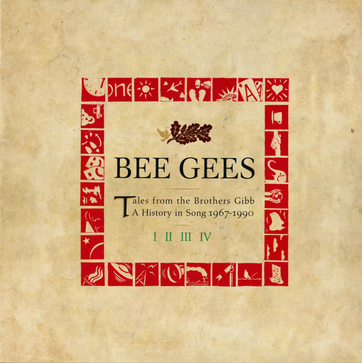

# Tales From The Brothers Gibb

By Bee Gees

## Album Data

- Catalog #: Roon
- Format: Digital, Album

## Track listing

1-1 New York Mining Disaster 1941
1-2 I Can't See Nobody
1-3 To Love Somebody
1-4 Holiday
1-5 Massachusetts
1-6 Barker of the U.F.O.
1-7 World
1-8 Sir Geoffrey Saved the World
1-9 And the Sun Will Shine
1-10 Words
1-11 Sinking Ships
1-12 Jumbo
1-13 The Singer Sang His Song
1-14 I've Gotta Get a Message to You
1-15 I Started a Joke
1-16 First of May
1-17 Melody Fair
1-18 Tomorrow, Tomorrow
1-19 Sun in My Morning
1-20 Saved by the Bell
1-21 Don't Forget to Remember
1-22 If I Only Had My Mind on Something Else
1-23 I.O.I.O.
1-24 Railroad
1-25 I'll Kiss Your Memory
2-1 Lonely Days
2-2 Morning of My Life (In the Morning)
2-3 How Can You Mend a Broken Heart?
2-4 Country Woman
2-5 Don't Wanna Live Inside Myself
2-6 My World
2-7 On Time
2-8 Run to Me
2-9 Alive
2-10 Saw a New Morning
2-11 Wouldn't I Be Someone
2-12 Elisa
2-13 King and Country
2-14 Mr. Natural
2-15 It Doesn't Matter Much to Me
2-16 Throw a Penny
2-17 Charade
3-1 Jive Talkin'
3-2 Nights on Broadway
3-3 Fanny (Be Tender With My Love)
3-4 You Should Be Dancing (long remix version)
3-5 Love So Right
3-6 Boogie Child
3-7 Edge of the Universe
3-8 How Deep Is Your Love
3-9 Stayin' Alive
3-10 Night Fever
3-11 More Than a Woman
3-12 If I Can't Have You
3-13 (Our Love) Don't Throw It All Away
3-14 Too Much Heaven
3-15 Tragedy
3-16 Love You Inside Out
4-1 He' a Liar
4-2 Another Lonely Night in New York
4-3 The Woman in You
4-4 Someone Belonging to Someone
4-5 Toys
4-6 My Eternal Love
4-7 Where Tomorrow Is
4-8 Letting Go
4-9 E-S-P
4-10 You Win Again
4-11 Ordinary Lives
4-12 One
4-13 Juliet
4-14 To Love Somebody
4-15 Medley: New York Mining Disaster 1941/.../World
4-16 Spicks and Specks

