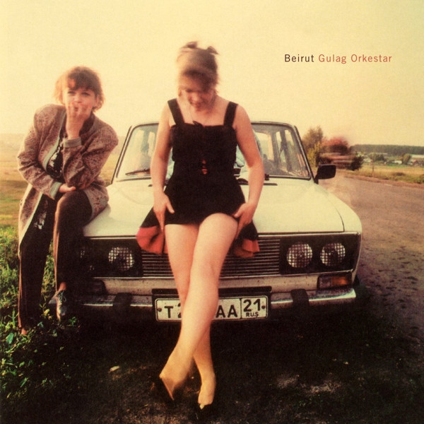

# Gulag Orkestar

By Beirut

## Album Data

- Catalog #: Roon
- Format: Digital, Album

## Track listing

1. The Gulag Orkestar
2. Prenzlauerberg
3. Brandenburg
4. Postcards from Italy
5. Mount Wroclai (Idle Days)
6. Rhineland (Heartland)
7. Scenic World
8. Bratislava
9. The Bunker
10. The Canals of Our City
11. After the Curtain

## See also

- [Artifacts](Artifacts.md)
- [Elephant Gun](Elephant_Gun.md)
- [Gallipoli](Gallipoli.md)
- [March of the Zapotec and Real People Holland](March_of_the_Zapotec_and_Real_People_Holland.md)
- [No No No](No_No_No.md)
- [The Flying Club Cup](The_Flying_Club_Cup.md)
- [The Rip Tide](The_Rip_Tide.md)
- [Beets: Gulag Orkestar](../../Beets/Beirut/Gulag_Orkestar.md)
- [Beets: Live at O-WEST 2012-01-23](../../Beets/Beirut/Live_at_O-WEST_2012-01-23.md)
