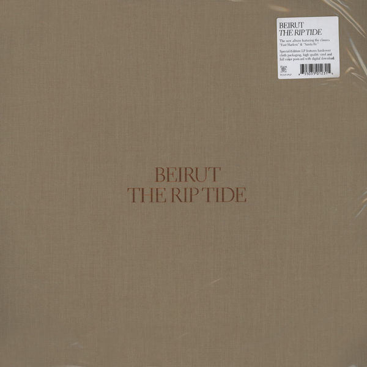

# The Rip Tide

By Beirut

## Album Data

- Catalog #: Roon
- Format: Digital, Album

## Track listing

1. A Candle's Fire
2. Santa Fe
3. East Harlem
4. Goshen
5. Payne's Bay
6. The Rip Tide
7. Vagabond
8. The Peacock
9. Port of Call

## See also

- [Artifacts](Artifacts.md)
- [Elephant Gun](Elephant_Gun.md)
- [Gallipoli](Gallipoli.md)
- [Gulag Orkestar](Gulag_Orkestar.md)
- [March of the Zapotec and Real People Holland](March_of_the_Zapotec_and_Real_People_Holland.md)
- [No No No](No_No_No.md)
- [The Flying Club Cup](The_Flying_Club_Cup.md)
- [Beets: Gulag Orkestar](../../Beets/Beirut/Gulag_Orkestar.md)
- [Beets: Live at O-WEST 2012-01-23](../../Beets/Beirut/Live_at_O-WEST_2012-01-23.md)
