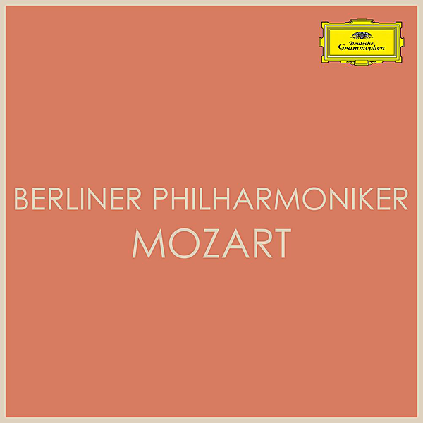

# Berliner Philharmoniker plays Mozart

By Berliner Philharmoniker

## Album Data

- Catalog #: Roon
- Format: Digital, Album

## Track listing

1. Mozart: Divertimento in B Flat Major, K. 137 - II. Allegro di molto
2. Mozart: Divertimento in B flat, K.137 - 3. Allegro assai
3. Mozart: Divertimento in D Major, K. 136 - III. Presto
4. Mozart: Requiem in D Minor, K. 626 - 3. Sequentia: Dies irae
5. Mozart: Serenata notturna in D, K.239 - 1. Marcia (Maestoso)
6. Mozart: Serenata notturna in D, K.239 - 2. Menuetto - Trio
7. Mozart: Serenata notturna in D, K.239 - 3. Rondeau (Allegretto - Adagio - Allegro)
8. Mozart: Divertimento in D Major, K. 136 - II. Andante
9. Mozart: Symphony No. 35 in D Major, K. 385 "Haffner" - 3. Menuetto
10. Mozart: Symphony No. 35 in D Major, K. 385 "Haffner" - 4. Finale (Presto)
11. Mozart: Serenade in G, K.525 "Eine kleine Nachtmusik" - 1. Allegro
12. Mozart: Mass In C Minor, K.427 "Große Messe" - Rev. And Reconstr. By H.C. Robbins Landon - Kyrie
13. Mozart: Mass In C Minor, K.427 "Große Messe" - Rev. And Reconstr. By H.C. Robbins Landon - Gloria: Gloria in excelsis Deo
14. Mozart: Mass In C Minor, K.427 "Große Messe" - Rev. And Reconstr. By H.C. Robbins Landon - Gloria: Laudamus te
15. Mozart: Mass In C Minor, K.427 "Große Messe" - Rev. And Reconstr. By H.C. Robbins Landon - Gloria: Gratias
16. Mozart: Mass In C Minor, K.427 "Große Messe" - Rev. And Reconstr. By H.C. Robbins Landon - Gloria: Domine
17. Mozart: Mass In C Minor, K.427 "Große Messe" - Rev. And Reconstr. By H.C. Robbins Landon - Gloria: Qui tollis
18. Mozart: Mass In C Minor, K.427 "Große Messe" - Rev. And Reconstr. By H.C. Robbins Landon - Gloria: Quoniam
19. Mozart: Mass In C Minor, K.427 "Große Messe" - Rev. And Reconstr. By H.C. Robbins Landon - Gloria: Jesu Christe
20. Mozart: Mass In C Minor, K.427 "Große Messe" - Rev. And Reconstr. By H.C. Robbins Landon - Gloria: Cum Sancto spiritu
21. Mozart: Mass In C Minor, K.427 "Große Messe" - Rev. And Reconstr. By H.C. Robbins Landon - Credo: Credo in unum Deum
22. Mozart: Mass In C Minor, K.427 "Große Messe" - Rev. And Reconstr. By H.C. Robbins Landon - Credo: Et incarnatus est
23. Mozart: Mass In C Minor, K.427 "Große Messe" - Rev. And Reconstr. By H.C. Robbins Landon - Sanctus: Sanctus
24. Mozart: Mass In C Minor, K.427 "Große Messe" - Rev. And Reconstr. By H.C. Robbins Landon - Benedictus
25. Mozart: Symphony No. 32 in G Major, K. 318 - 1. Allegro - 2. Andante - 3. Tempo I
26. Mozart: Symphony No. 33 in B flat, K.319 - 1. Allegro assai
27. Mozart: Symphony No. 33 in B flat, K.319 - 2. Andante moderato
28. Mozart: Symphony No. 33 in B flat, K.319 - 3. Menuetto
29. Mozart: Symphony No. 33 in B flat, K.319 - 4. Finale (Allegro assai)
30. Mozart: Serenade in G Major, K. 525 "Eine kleine Nachtmusik" - I. Allegro
31. Mozart: Serenade in G Major, K. 525 "Eine kleine Nachtmusik" - II. Romance (Andante)
32. Mozart: Serenade in G Major, K. 525 "Eine kleine Nachtmusik" - III. Menuetto (Allegretto)
33. Mozart: Serenade in G Major, K. 525 "Eine kleine Nachtmusik" - IV. Rondo (Allegro)
34. Mozart: Die Zauberflöte, K.620 - Overture
35. Mozart: Mass In C, K.317 "Coronation" - 1. Kyrie
36. Mozart: Mass In C, K.317 "Coronation" - 2. Gloria
37. Mozart: Mass In C, K.317 "Coronation" - 3. Credo
38. Mozart: Mass In C, K.317 "Coronation" - 4. Sanctus
39. Mozart: Mass In C, K.317 "Coronation" - 5. Benedictus
40. Mozart: Mass In C, K.317 "Coronation" - 6. Agnus Dei
41. Mozart: Mass In C, K.317 "Coronation" - 7. Agnus Dei. Dona nobis pacem - Allegro con spirito
42. Mozart: Adagio and Fugue in C Minor, K. 546 - Orchestral Version
43. Mozart: Serenade No. 9 in D Major, K. 320 "Posthorn" - III. Concertante (Andante grazioso)
44. Mozart: Serenade No. 9 in D Major, K. 320 "Posthorn" - IV. Rondeau (Allegro ma non troppo)
45. Mozart: Divertimento No. 15 in B Flat Major, K. 287 - I. Allegro
46. Mozart: Divertimento No. 15 in B Flat Major, K.287 - 2. Tema con variazioni: Andante grazioso
47. Mozart: Divertimento No. 15 in B Flat Major, K. 287 - III. Menuetto (I)
48. Mozart: Divertimento No. 15 in B Flat Major, K. 287 - IV. Adagio
49. Mozart: Divertimento No. 15 in B Flat Major, K. 287 - V. Menuetto (II)
50. Mozart: Divertimento No. 15 in B Flat Major, K. 287 - VI. Andante - Allegro molto
51. Mozart: Divertimento No. 11 in D, K.251 "Nannerl-Septett" - Allegro molto
52. Mozart: Divertimento No. 11 in D Major, K. 251 "Nannerl-Septett" - Menuetto (III)
53. Mozart: Divertimento No. 11 in D, K.251 "Nannerl-Septett" - Andantino
54. Mozart: Divertimento No. 11 in D, K.251 "Nannerl-Septett" - Menuetto (Tema con variazioni)
55. Mozart: Divertimento No. 11 in D, K.251 "Nannerl-Septett" - Rondeau (Allegro assai)
56. Mozart: Divertimento No. 11 in D, K.251 "Nannerl-Septett" - Marcia alla francese
57. Mozart: Divertimento In F, K.247 - Allegro
58. Mozart: Divertimento In F, K.247 - Andante grazioso
59. Mozart: Divertimento In F, K.247 - Menuetto
60. Mozart: Divertimento In F, K.247 - Adagio
61. Mozart: Divertimento In F, K.247 - Menuetto (I)
62. Mozart: Divertimento In F, K.247 - Andante - Allegro assai
63. Mozart: Divertimento in D Major, K. 136 - I. Allegro
64. Mozart: Divertimento in B flat, K.137 - 1. Andante
65. Mozart: Divertimento in F Major, K.138 - I. (Allegro)
66. Mozart: Divertimento in F Major, K. 138 - II. Andante
67. Mozart: Divertimento in F Major, K. 138 - III. Presto
68. Mozart: Piano Concerto No. 26 in D Major, K. 537 "Coronation" - I. Allegro (Cadenza: Müller)
69. Mozart: Piano Concerto No. 26 in D Major, K. 537 "Coronation" - II. (Larghetto)
70. Mozart: Piano Concerto No. 26 in D Major, K. 537 "Coronation" - III. (Allegretto)
71. Mozart: Piano Concerto No. 10 in E Flat Major, K. 365 - I. Allegro
72. Mozart: Piano Concerto No. 10 in E Flat Major, K. 365 - II. Andante
73. Mozart: Piano Concerto No. 10 in E Flat Major, K. 365 - 3. Rondeau. Allegro
74. Mozart: Concert Rondo in D Major K. 382
75. Mozart: Rondo for Piano and Orchestra in A Major, K. 386
76. Mozart: Violin Concerto No. 3 in G, K.216 - 1. Allegro
77. Mozart: Violin Concerto No. 3 in G, K.216 - 2. Adagio
78. Mozart: Violin Concerto No. 3 in G, K.216 - 3. Rondo (Allegro)
79. Mozart: Violin Concerto No. 5 In A, K.219 - 1. Allegro aperto
80. Mozart: Violin Concerto No. 5 In A, K.219 - 2. Adagio
81. Mozart: Violin Concerto No. 5 In A, K.219 - 3. Rondeau (Tempo di minuetto)

