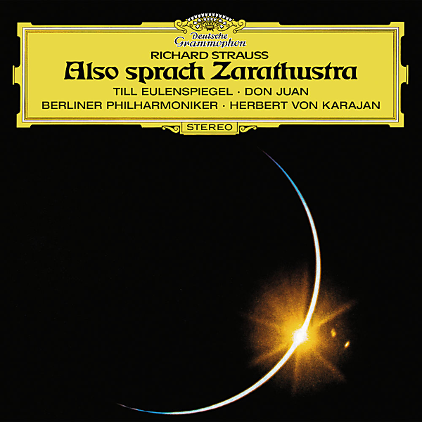

# Strauss: Also sprach Zarathustra, Till Eulenspiegel

By Berliner Philharmoniker

## Album Data

- Catalog #: Roon
- Format: Digital, Album

## Track listing

1. Also sprach Zarathustra (Thus Spoke Zoroaster), tone poem for orchestra, Op. 30 (TrV 176): Introduction
2. Also sprach Zarathustra (Thus Spoke Zoroaster), tone poem for orchestra, Op. 30 (TrV 176): Of The Backworldsmen
3. Also sprach Zarathustra (Thus Spoke Zoroaster), tone poem for orchestra, Op. 30 (TrV 176): Of The Great Longing
4. Also sprach Zarathustra (Thus Spoke Zoroaster), tone poem for orchestra, Op. 30 (TrV 176): Of Joys and Passions
5. Also sprach Zarathustra (Thus Spoke Zoroaster), tone poem for orchestra, Op. 30 (TrV 176): The Song of The Grave
6. Also sprach Zarathustra (Thus Spoke Zoroaster), tone poem for orchestra, Op. 30 (TrV 176): Of Science And Learning
7. Also sprach Zarathustra (Thus Spoke Zoroaster), tone poem for orchestra, Op. 30 (TrV 176): The Convalescent
8. Also sprach Zarathustra (Thus Spoke Zoroaster), tone poem for orchestra, Op. 30 (TrV 176): The Dance Song
9. Also sprach Zarathustra (Thus Spoke Zoroaster), tone poem for orchestra, Op. 30 (TrV 176): Song of The Night Wanderer
10. Till Eulenspiegels lustige Streiche (Till Eulenspiegel's Merry Pranks), tone poem for orchestra, Op. 28 (TrV 171)
11. Don Juan, tone poem for orchestra, Op. 20 (TrV 156)
12. Salome's Dance, for orchestra (from the opera; aka "Dance of the Seven Veils") (TrV 215a)

## See also

- [Anton Dvorák](Anton_Dvorák_-_Violin_Concerto_-_Romance_-_Mazurka_-_Humoresque.md)
- [Beethoven](Beethoven_-_9_Symphonies_1963.md)
- [Berliner Philharmoniker plays Mozart](Berliner_Philharmoniker_plays_Mozart.md)
- [Dvorák](Dvorák-_Symphony_No_9_-_Smetana-_Die_Moldau_Édition_Studio_Masters.md)
- [R. Strauss](R_Strauss_-_Also_sprach_Zarathustra.md)
