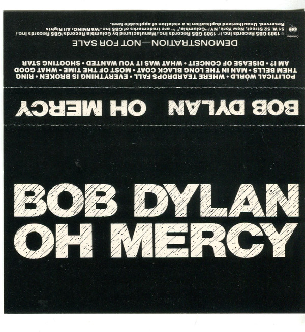

# Oh Mercy

By Bob Dylan

## Album Data

- Catalog #: Roon
- Format: Digital, Album

## Track listing

1. Political World
2. Where Teardrops Fall
3. Everything Is Broken
4. Ring Them Bells
5. Man in the Long Black Coat
6. Most of the Time
7. What Good Am I?
8. Disease of Conceit
9. What Was It You Wanted
10. Shooting Star

## See also

- [Blood On The Tracks](Blood_On_The_Tracks.md)
- [Desire](Desire.md)
- [Beets: Desire](../../Beets/Bob_Dylan/Desire.md)
- [Beets: Live At The 34th New Orleans Jazz & Heritage Festival](../../Beets/Bob_Dylan/Live_At_The_34th_New_Orleans_Jazz_and_Heritage_Festival.md)
- [Beets: The 30th Anniversary Concert Celebration - Disc 1](../../Beets/Bob_Dylan/The_30th_Anniversary_Concert_Celebration_-_Disc_1.md)
- [Beets: The Best of Bob Dylan](../../Beets/Bob_Dylan/The_Best_of_Bob_Dylan.md)
- [Beets: The Freewheelin' Bob Dylan](../../Beets/Bob_Dylan/The_Freewheelin_Bob_Dylan.md)
- [Vinyl: ](../../Vinyl/Bob_Dylan/Bob_Dylan.md)
- [Vinyl: Self Portrait](../../Vinyl/Bob_Dylan/Self_Portrait.md)
