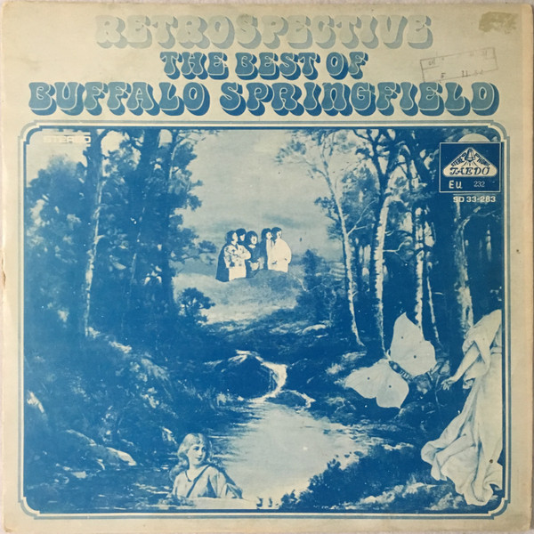

# Retrospective: The Best Of Buffalo Springfield

By Buffalo Springfield

## Album Data

- Catalog #: Roon
- Format: Digital, Album

## Track listing

1. For What It's Worth
2. Mr. Soul
3. Sit Down I Think I Love You
4. Kind Woman
5. Bluebird
6. On the Way Home
7. Nowadays Clancy Can't Even Sing
8. Broken Arrow
9. Rock & Roll Woman
10. I Am a Child
11. Go and Say Goodbye
12. Expecting to Fly

## See also

- [Buffalo Springfield Again](Buffalo_Springfield_Again.md)
- [Buffalo Springfield](Buffalo_Springfield.md)
- [Last Time Around](Last_Time_Around.md)
- [What's That Sound? - Complete Albums Collection (Remastered) (2018 Remaster)](Whats_That_Sound_-_Complete_Albums_Collection_Remastered_2018_Remaster.md)
- [Beets: Buffalo Springfield Again](../../Beets/Buffalo_Springfield/Buffalo_Springfield_Again.md)
- [Beets: Buffalo Springfield](../../Beets/Buffalo_Springfield/Buffalo_Springfield.md)
- [Vinyl: ](../../Vinyl/Buffalo_Springfield/Buffalo_Springfield.md)
- [Vinyl: Last Time Around](../../Vinyl/Buffalo_Springfield/Last_Time_Around.md)
- [Vinyl: Rock 'N' Roll Woman / A Child's Claim To Fame](../../Vinyl/Buffalo_Springfield/Rock_N_Roll_Woman_-_A_Childs_Claim_To_Fame.md)
