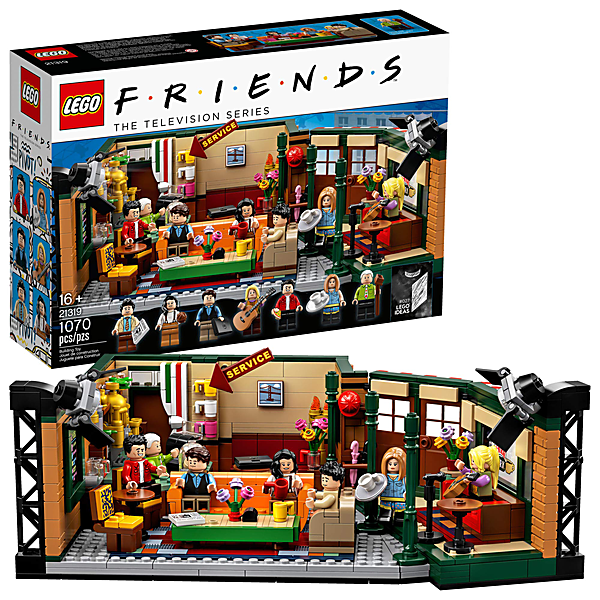

# What's That Sound? - Complete Albums Collection (Remastered) (2018 Remaster)

By Buffalo Springfield

## Album Data

- Catalog #: Roon
- Format: Digital, Album

## Track listing

1-1 Go and Say Goodbye [Mono]
1-2 Sit Down I Think I Love You [Mono]
1-3 Leave [Mono]
1-4 Nowadays Clancy Can't Even Sing [Mono]
1-5 Hot Dusty Roads [Mono]
1-6 Everybody's Wrong [Mono]
1-7 Flying on the Ground Is Wrong [Mono]
1-8 Burned [Mono]
1-9 Do I Have to Come Right Out and Say It [Mono]
1-10 Baby Don't Scold Me [Mono]
1-11 Out of My Mind [Mono]
1-12 Pay the Price [Mono]
1-13 For What It's Worth [Mono]
2-1 For What It's Worth
2-2 Go and Say Goodbye
2-3 Sit Down I Think I Love You
2-4 Nowadays Clancy Can't Even Sing
2-5 Hot Dusty Roads
2-6 Everybody's Wrong
2-7 Flying on the Ground Is Wrong
2-8 Burned
2-9 Do I Have to Come Out and Say It
2-10 Leave
2-11 Out of My Mind
2-12 Pay the Price
3-1 Mr. Soul [Mono]
3-2 A Child's Claim to Fame [Mono]
3-3 Everydays [Mono]
3-4 Expecting to Fly [Mono]
3-5 Bluebird [Mono]
3-6 Hung Upside Down [Mono]
3-7 Sad Memory [Mono]
3-8 Good Time Boy [Mono]
3-9 Rock & Roll Woman [Mono]
3-10 Broken Arrow [Mono]
4-1 Mr. Soul
4-2 A Child's Claim to Fame
4-3 Everydays
4-4 Expecting to Fly
4-5 Bluebird
4-6 Hung Upside Down
4-7 Sad Memory
4-8 Good Time Boy
4-9 Rock & Roll Woman
4-10 Broken Arrow
5-1 On the Way Home
5-2 It's So Hard to Wait
5-3 Pretty Girl Why
5-4 Four Days Gone
5-5 Carefree Country Day
5-6 Special Care
5-7 The Hour of Not Quite Rain
5-8 Questions
5-9 I Am a Child
5-10 Merry-Go-Round
5-11 Uno Mundo
5-12 Kind Woman

