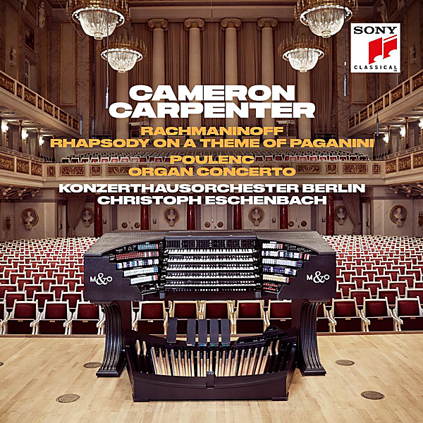

# Rachmaninoff: Rhapsody on a Theme of Paganini & Poulenc: Organ Concerto

By Cameron Carpenter

## Album Data

- Catalog #: Roon
- Format: Digital, Album

## Track listing

1. Rhapsody on a Theme of Paganini Op. 43, version for Organ and Orchestra: Introduction. Allegro vivace - Var. I (Precedente)
2. Rhapsody on a Theme of Paganini Op. 43, version for Organ and Orchestra: Tema. L'istesso tempo
3. Rhapsody on a Theme of Paganini Op. 43, version for Organ and Orchestra: Var. II. L'istesso tempo
4. Rhapsody on a Theme of Paganini Op. 43, version for Organ and Orchestra: Var. III. L'istesso tempo
5. Rhapsody on a Theme of Paganini Op. 43, version for Organ and Orchestra: Var. IV. Più vivo
6. Rhapsody on a Theme of Paganini Op. 43, version for Organ and Orchestra: Var. V. Tempo precedente
7. Rhapsody on a Theme of Paganini Op. 43, version for Organ and Orchestra: Var. VI. L'istesso tempo
8. Rhapsody on a Theme of Paganini Op. 43, version for Organ and Orchestra: Var. VII. Meno mosso, a tempo moderato
9. Rhapsody on a Theme of Paganini Op. 43, version for Organ and Orchestra: Var. VIII. Tempo I
10. Rhapsody on a Theme of Paganini Op. 43, version for Organ and Orchestra: Var. IX. L'istesso tempo
11. Rhapsody on a Theme of Paganini Op. 43, version for Organ and Orchestra: Var. X. Poco marcato
12. Rhapsody on a Theme of Paganini Op. 43, version for Organ and Orchestra: Var. XI. Moderato
13. Rhapsody on a Theme of Paganini Op. 43, version for Organ and Orchestra: Var. XII. Tempo di minuetto
14. Rhapsody on a Theme of Paganini Op. 43, version for Organ and Orchestra: Var. XIII. Allegro
15. Rhapsody on a Theme of Paganini Op. 43, version for Organ and Orchestra: Var. XIV. L'istesso tempo
16. Rhapsody on a Theme of Paganini Op. 43, version for Organ and Orchestra: Var. XV. Più vivo, scherzando
17. Rhapsody on a Theme of Paganini Op. 43, version for Organ and Orchestra: Var. XVI. Allegretto
18. Rhapsody on a Theme of Paganini Op. 43, version for Organ and Orchestra: Var. XVII
19. Rhapsody on a Theme of Paganini Op. 43, version for Organ and Orchestra: Var. XVIII. Andante cantabile
20. Rhapsody on a Theme of Paganini Op. 43, version for Organ and Orchestra: Var. XIX. L'istesso tempo
21. Rhapsody on a Theme of Paganini Op. 43, version for Organ and Orchestra: Var. XX. Un poco più vivo
22. Rhapsody on a Theme of Paganini Op. 43, version for Organ and Orchestra: Var. XXI. Un poco più vivo
23. Rhapsody on a Theme of Paganini Op. 43, version for Organ and Orchestra: Var. XXII. Un poco più vivo (Alla breve)
24. Rhapsody on a Theme of Paganini Op. 43, version for Organ and Orchestra: Var. XXIII. L'istesso tempo
25. Rhapsody on a Theme of Paganini Op. 43, version for Organ and Orchestra: Var. XXIV. A tempo un poco meno mosso
26. Concerto for Organ, Strings and Timpani in G minor FP 93: Andante
27. Concerto for Organ, Strings and Timpani in G minor FP 93: Allegro giocoso
28. Concerto for Organ, Strings and Timpani in G minor FP 93: Subito andante moderato
29. Concerto for Organ, Strings and Timpani in G minor FP 93: Tempo allegro. Molto agitato
30. Concerto for Organ, Strings and Timpani in G minor FP 93: Très calme. Lent
31. Concerto for Organ, Strings and Timpani in G minor FP 93: Tempo de l'allegro initial
32. Concerto for Organ, Strings and Timpani in G minor FP 93: Tempo de l'introduction. Largo
33. Organ Symphony No. 1 in D minor Op. 14: VI. Final. Allegro

