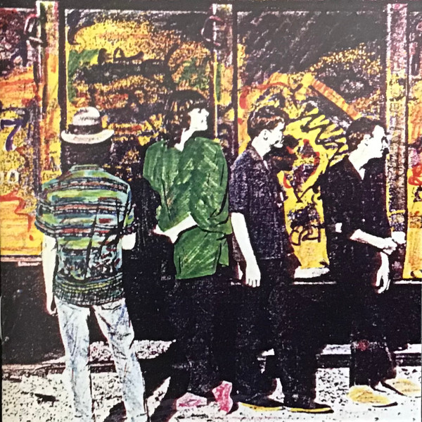

# Cigarettes & Carrot Juice: The Santa Cruz Years

By Camper Van Beethoven

## Album Data

- Catalog #: Roon
- Format: Digital, Album

## Track listing

4-1 Heart
4-2 Never Go Back
4-3 Seven Languages
4-4 Axe Murderer Song
4-5 SP 37597
4-6 Crossing Over
4-7 Guardian Angels
4-8 I'm Not Like Everybody Else
4-9 A.C. Cover
4-10 Porpoise Mouth
4-11 (We Workers Do No Understand) Modern Art
4-12 We Eat Your Children
4-13 Six More Miles to the Graveyard
4-14 Ice Cream Everyday
4-15 Processional
4-16 Photograph/Om Eye (Sweet Isthmus)

## Track listing

4-1 Heart
4-2 Never Go Back
4-3 Seven Languages
4-4 Axe Murderer Song
4-5 SP 37597
4-6 Crossing Over
4-7 Guardian Angels
4-8 I'm Not Like Everybody Else
4-9 A.C. Cover
4-10 Porpoise Mouth
4-11 (We Workers Do No Understand) Modern Art
4-12 We Eat Your Children
4-13 Six More Miles to the Graveyard
4-14 Ice Cream Everyday
4-15 Processional
4-16 Photograph/Om Eye (Sweet Isthmus)

