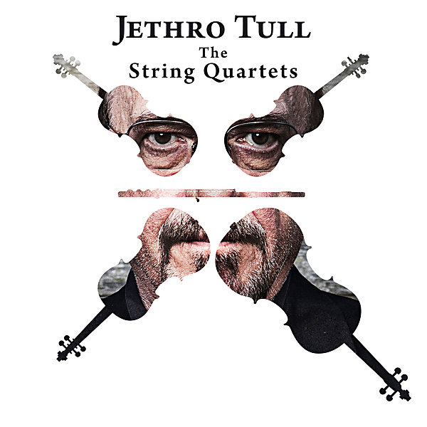

# Jethro Tull - The String Quartets

By Carducci String Quartet

## Album Data

- Catalog #: Roon
- Format: Digital, Album

## Track listing

1. In the Past (Living in the Past)
2. Sossity Waiting (Sossity, You're a Woman/Reasons for Waiting)
3. Bungle (Bungle in the Jungle)
4. We Used to Bach (We Used to Know/Bach Prelude C Major)
5. Farm, the Fourway (Farm on the Freeway)
6. Songs and Horses (Songs From the Wood/Heavy Horses)
7. Only the Giving (Wond'ring Aloud)
8. Loco (Locomotive Breath)
9. Pass the Bottle (A Christmas Song)
10. Velvet Gold (Velvet Green)
11. Ring Out These Bells (Ring Out, Solstice Bells)
12. Aquafugue (Aqualung)

