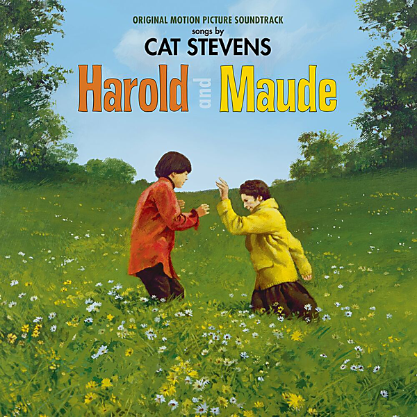

# Harold and Maude [Original Motion Picture Soundtrack]

By Cat Stevens

## Album Data

- Catalog #: Roon
- Format: Digital, Album

## Track listing

1. Don't Be Shy
2. Dialogue 1 [I Go to Funerals]
3. On the Road to Find Out
4. I Wish, I Wish
5. Tchaikovsky's Concerto No.1 in B (From 'Harold and Maude' original Motion Picture Soundtrack)
6. Dialogue 2 [How Many Suicides]
7. Marching Band/Dialogue 3 [Harold Meets Maude]
8. Miles From Nowhere
9. Tea for the Tillerman
10. I Think I See the Light
11. Dialogue 4 [Sunflower]
12. Where Do the Children Play? (edit / From 'Harold and Maude' original Motion Picture Soundtrack)
13. If You Want to Sing Out, Sing Out (Ruth Gordon & Bud Cort vocal version / From 'Harold and Maude' original Motion Picture Soundtrack)
14. Strauss' Blue Danube (From 'Harold and Maude' original Motion Picture Soundtrack)
15. Dialogue 5 [Somersaults]
16. If You Want to Sing Out, Sing Out
17. Dialogue 6 [Harold Loves Maude]
18. Trouble
19. If You Want to Sing Out, Sing Out (Ending)

